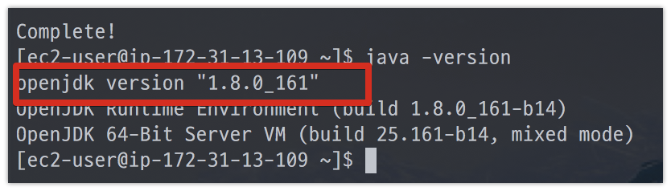
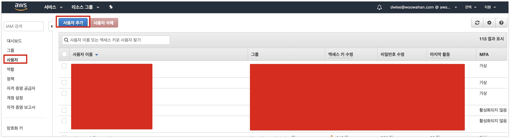
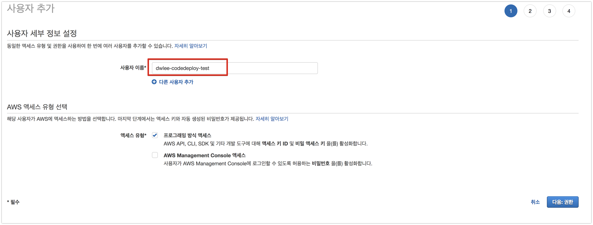
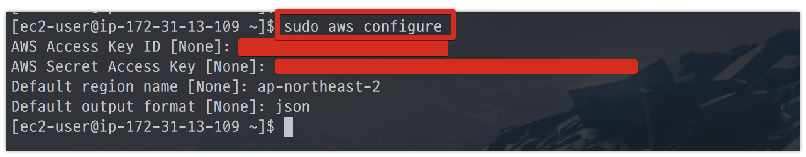
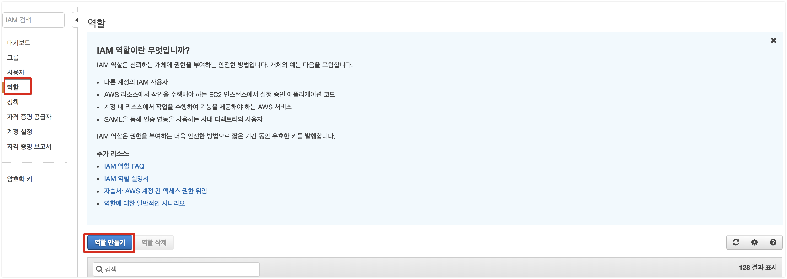
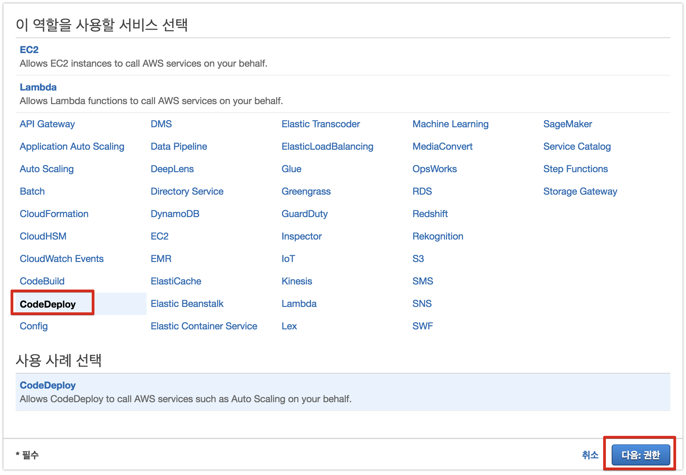
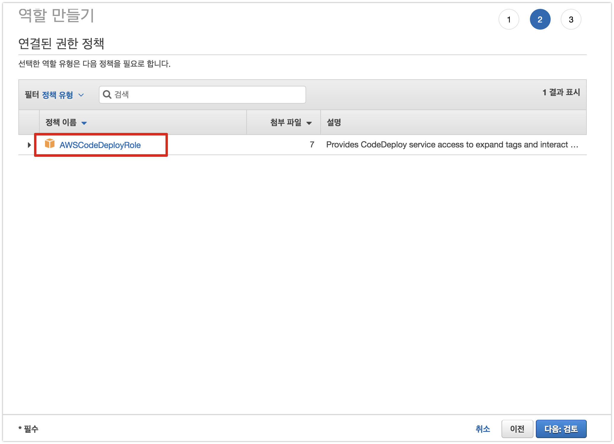
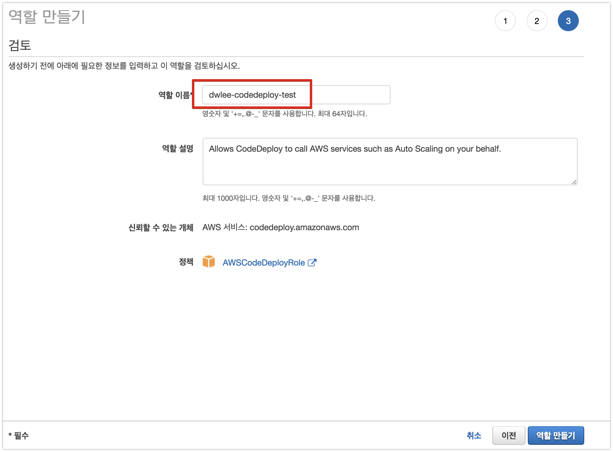

# AWS Auto Scaling

 
## 1. EC2 인스턴스 생성


### 1-1. Java8 설치

EC2 인스턴스로 ssh 접속후 다음의 명령어를 실행합니다.

```bash
sudo yum update
sudo yum install -y java-1.8.0-openjdk-devel.x86_64
sudo /usr/sbin/alternatives --config java
sudo yum remove java-1.7.0-openjdk
java -version
```



이외에 필요한 것들이 더 있으시면 설치하시면 됩니다.  
저는 스프링부트의 jar 실행외에 EC2에서 하는게 없어서 Java8만 설치합니다.  

### 1-2. Code Deploy Agent 설치

#### 그룹 생성

```json
{
    "Version": "2012-10-17",
    "Statement": [
        {
            "Effect": "Allow",
            "Action": [
                "autoscaling:*",
                "codedeploy:*",
                "ec2:*",
                "lambda:*",
                "elasticloadbalancing:*",
                "s3:*",
                "cloudwatch:*",
                "logs:*",
                "sns:*"
            ],
            "Resource": "*"
        }
    ]
}
```

#### 사용자 추가





#### EC2에 Code Deploy Agent 설치

```bash
sudo yum install -y aws-cli
```

```bash
cd /home/ec2-user/ 
sudo aws configure
```



* Access Key
* Secret Access Key
* region name
  * ap-northeast-2
  * 서울 리전을 얘기합니다.
* output format
  * json


설치파일 받기

```bash
wget https://aws-codedeploy-ap-northeast-2.s3.amazonaws.com/latest/install
```

```bash
chmod +x ./install
```

```bash
sudo ./install auto
```

설치가 완료되셨으면 아래 명령어로 Agent가 실행중인지 확인합니다.

```bash
sudo service codedeploy-agent status
```

마지막으로 EC2 인스턴스가 부팅되면 자동으로 AWS CodeDeploy Agent가 실행될 수 있도록 /etc/init.d/에 쉘 스크립트 파일을 하나 생성하겠습니다.

```bash
sudo vim /etc/init.d/codedeploy-startup.sh
```

```bash
#!/bin/bash 
echo 'Starting codedeploy-agent' 
sudo service codedeploy-agent start
```

### 1-3. Cloud Watch 세팅


## 2. AMI 생성









pending이 avaliable로 변경되면 이미지 생성이 완료된 것입니다.

## 3. Auto Scaling Group에서 Launch Configuration 생성