# 1. AWS Code Deploy로 배포하기

AWS로 전체 시스템 구축해야 할 일이 생겨 AWS 배포 환경 시리즈를 시작합니다.  
시리즈 과정은 CodeDeploy -> Code Pipeline -> ELB & Auto Scaling Group -> Beanstalk 으로 진행될 예정입니다.  
  
> Code Pipeline vs Beanstalk 비교가 목표입니다.

포스팅에서 사용된 코드는 모두 [Github](https://github.com/jojoldu/springboot-deploy)에 있습니다.  
  
> 여기서 사용되는 모든 과정은 **프리 티어라도 비용이 청구**될수 있습니다.  
비용에 관한 어떠한 책임도 여기서 책임지지 않으니 주의해주세요!  
프리티어 내에서 완전 무료로 AWS 배포를 경험하고 싶으시다면 [이전 포스팅](http://jojoldu.tistory.com/265)을 참고하시길 추천드립니다.  

처음 과정은 단순하게 AWS Code Deploy만으로 진행합니다.

## 1-1. IAM Role 생성

EC2를 생성하기 전에, EC2가 사용할 수 있는 IAM Role을 먼저 생성하겠습니다.  
서비스에서 IAM을 검색후 **역할 만들기**를 클릭합니다.


이 역할은 EC2에서 사용할 예정이니 EC2를 선택합니다.


연결한 정책에는 총 4개를 선택합니다.


* AmazonS3FullAccess 
* AWSCodeDeployFullAccess 
* AWSCodeDeployRole 
* CloudWatchLogsFullAccess 

마지막 검토에는 다음과 같이 노출되어야 합니다.


**역할 만들기**로 최종 생성하시면 아래와 같이 조회가 되면 됩니다.


## 1-2. EC2 생성

IAM Role 생성이 끝났으니, EC2를 생성합니다.  
기본적인 과정은 기존에 하시던대로 하시면 됩니다.


IAM 역할에선 **1-1에서 생성한 IAM Role을 선택**합니다.  
추가로, CloudWatch 모니터링도 활성화 체크 합니다.  


스토리지의 경우 **30GB까지가 프리티어**이기 때문에 30으로 변경합니다.


인스턴스 검색을 쉽게 하기 위해 **Name** 태그를 추가합니다.


기존에 사용하시던 키 페어가 있으시면 해당 키 페어를 사용하시고, 없으시면 새로 만듭니다.


인스턴스 상태가 running으로 변경되면 EC2 생성이 완료 됩니다.


## 1-3. EC2 설정

EC2 인스턴스로 ssh 접속 후 다음의 명령어를 실행합니다.  
혹시나 pem키 접속시 아래와 같이 permission 오류가 발생하신다면, 


아래 명령어로 개인계정 read 권한만 할당합니다.

```bash
chmod 400 pem키
```

### 1-3-1. Java8 설치

EC2에 SSH 접속 되셨다면, Java8을 설치합니다.

```bash
sudo yum update
sudo yum install -y java-1.8.0-openjdk-devel.x86_64
sudo /usr/sbin/alternatives --config java
sudo yum remove java-1.7.0-openjdk
```


java 버전을 확인해봅니다.

```bash
java -version
```


이외에 필요한 것들이 더 있으시면 설치하시면 됩니다.  
(스프링부트 프로젝트에는 이외에는 별도로 필요한게 없습니다.)  

### 1-3-2. Code Deploy Agent용 사용자 추가

이제 EC2가 Code Deploy 이벤트를 수신할 수 있도록 Agent를 설치해야하는데요.  
그전에 EC2에서 AWS CLI를 사용할 수 있도록, IAM 사용자를 하나 추가하겠습니다.  
IAM 사용자는 보통 IAM 정책이 적용된 그룹 생성 -> 해당 그룹에 사용자 추가로 진행합니다.  
  
그래서 그룹부터 먼저 생성하겠습니다.


정책 선택은 아무것도 하지않고 넘깁니다.  
(정책은 이후 **JSON으로 한번에 적용**할 예정입니다.)  


그룹 생성이 완료된 후, 해당 그룹으로 이동해보시면


권한 -> 인라인 정책 탭을 수정합니다.


정책 문서에 하단의 JSON 코드를 그대로 추가합니다.


```json
{
    "Version": "2012-10-17",
    "Statement": [
        {
            "Effect": "Allow",
            "Action": [
                "autoscaling:*",
                "codedeploy:*",
                "ec2:*",
                "lambda:*",
                "elasticloadbalancing:*",
                "s3:*",
                "cloudwatch:*",
                "logs:*",
                "sns:*"
            ],
            "Resource": "*"
        }
    ]
}
```

* Version은 무조건 ```"2012-10-17"``` 만 됩니다.

정책이 성공적으로 추가됐습니다.

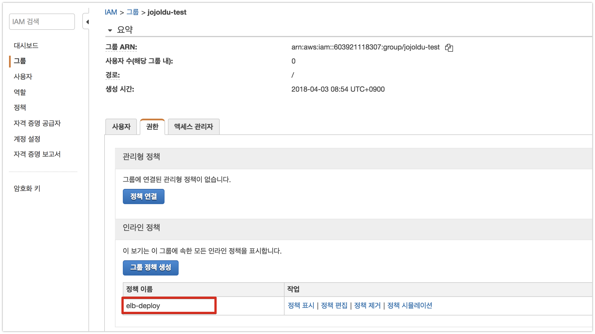

그룹 생성과 편집이 끝났으니, 적절한 사용자를 추가하겠습니다.  

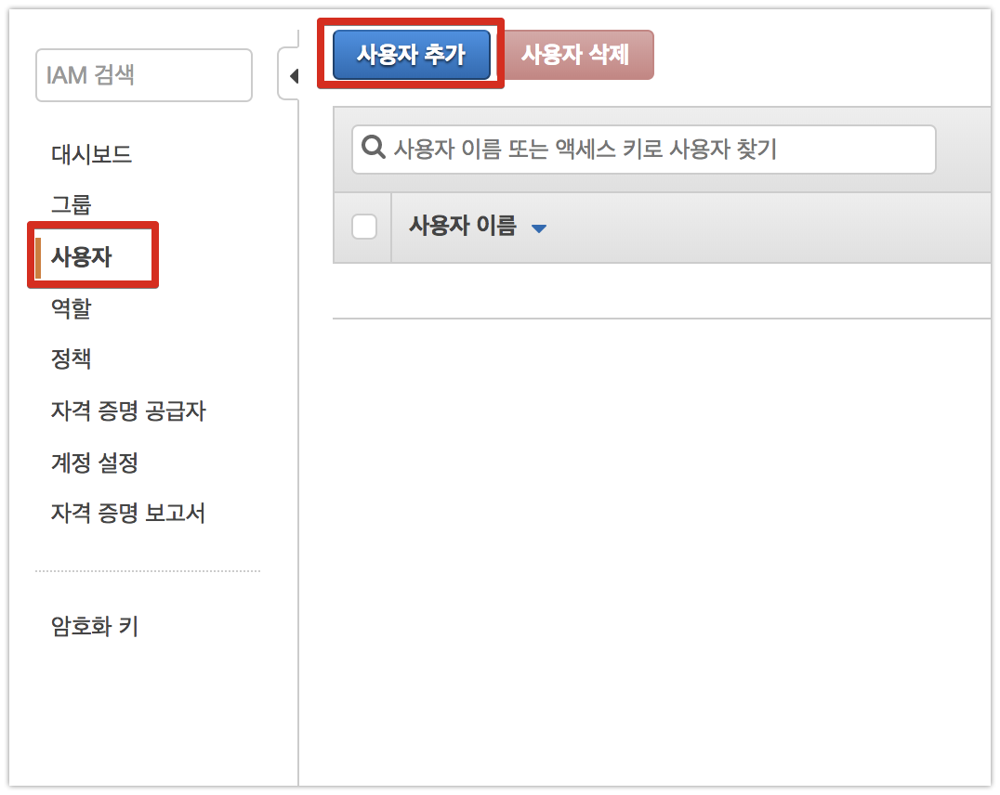

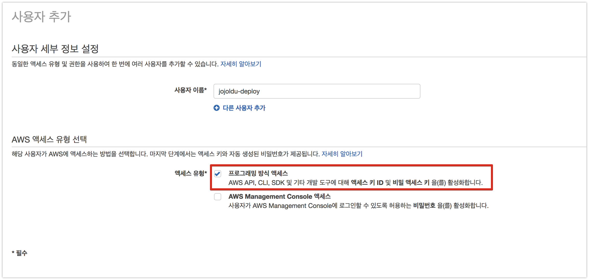

그룹에 사용자 추가하기 버튼을 클릭하신뒤, 방금 생성한 그룹을 선택합니다.

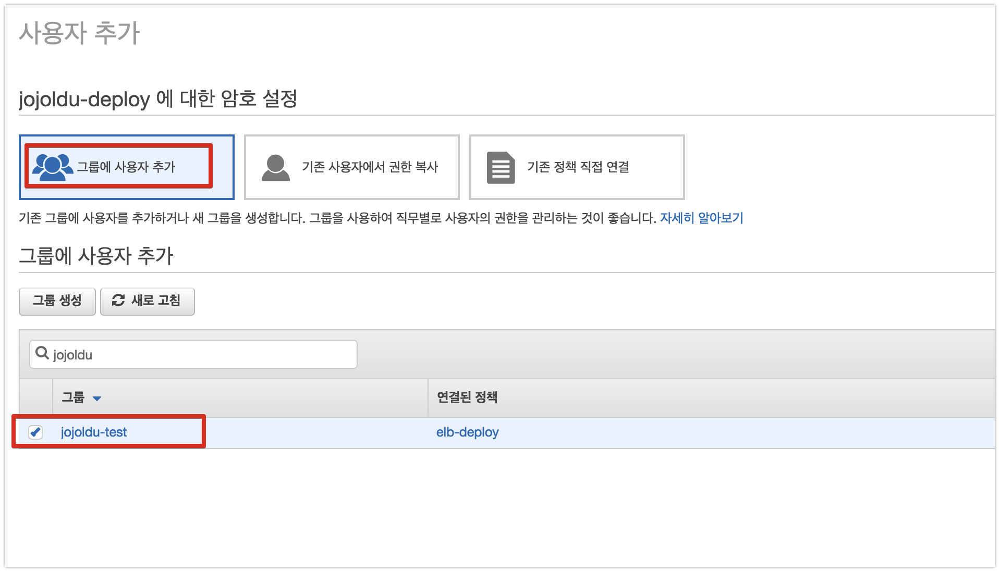

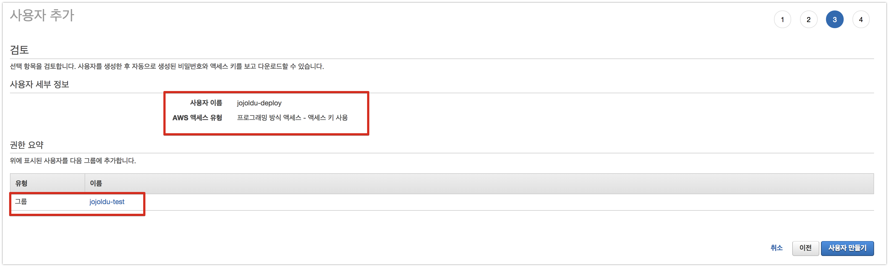

최종 사용자 생성이 완료되면, 해당 사용자를 인증할 수 있는 엑세스키가 생성됩니다.  
현재 페이지에서만 받을수 있으니, 얼른 ```.csv```를 다운받습니다.

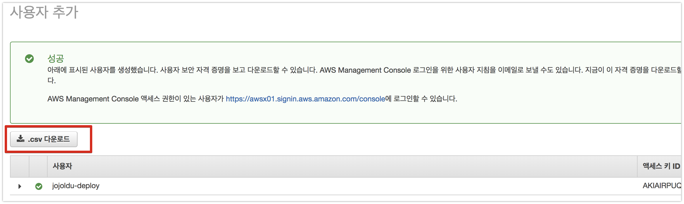

여기까지 하셨다면 다시 EC2로 돌아가서 Code Deploy Agent를 설치하겠습니다.

### 1-3-3. EC2에 Code Deploy Agent 설치

EC2에 CodeDeploy로 지정한 위치에서 파일을 받아 실행하기 위해서는 Code Deploy Agent가 설치되있어야만 합니다.  
이를 진행하겠습니다.  
  
EC2에 접속하시고, ```aws-cli```를 먼저 설치합니다.

```bash
sudo yum install -y aws-cli
```

사용자 홈으로 이동하고 aws cli 설정을 시작합니다.

```bash
cd /home/ec2-user/ 
sudo aws configure
```


* Access Key
  * 좀전에 생성한 사용자의 엑세스키 (.csv파일에 있음)를 등록합니다.
* Secret Access Key
  * 좀전에 생성한 사용자의 시크릿키 (.csv파일에 있음)를 등록합니다.
* region name
  * ap-northeast-2
  * 서울 리전을 얘기합니다.
* output format
  * json

aws 설정이 끝나셨다면, Agent 설치파일을 다운받겠습니다.

```bash
wget https://aws-codedeploy-ap-northeast-2.s3.amazonaws.com/latest/install
```

해당 파일에 실행권한을 추가합니다.

```bash
chmod +x ./install
```

실행권한이 추가되셨다면, 설치를 진행합니다.

```bash
sudo ./install auto
```

설치가 완료되셨으면 아래 명령어로 Agent가 실행중인지 확인합니다.

```bash
sudo service codedeploy-agent status
```

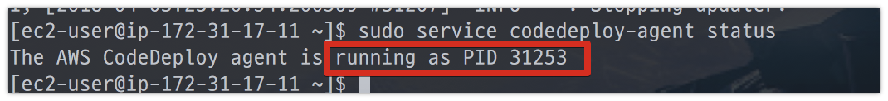

마지막으로 EC2 인스턴스가 부팅되면 자동으로 AWS CodeDeploy Agent가 실행될 수 있도록 /etc/init.d/에 쉘 스크립트 파일을 하나 생성하겠습니다.

```bash
sudo vim /etc/init.d/codedeploy-startup.sh
```

스크립트 내용은 아래와 같습니다.

```bash
#!/bin/bash 
echo 'Starting codedeploy-agent' 
sudo service codedeploy-agent restart
```

스크립트 파일을 저장한뒤, 실행권한을 추가합니다.

```bash
sudo chmod +x /etc/init.d/codedeploy-startup.sh
```

EC2에 CodeDeloy Agent 설치가 완료되었습니다!  

## 1-4. 프로젝트 생성하기

Code Deploy로 배포할 간단한 스프링부트 프로젝트를 생성하시고, 이를 Github과 연결합니다.  
(제가 만든 프로젝트는 [여기](https://github.com/jojoldu/springboot-deploy)에 있습니다.)  
  
> 프로젝트 환경은 java8 / SpringBoot / Gradle 입니다.

간단한 프로젝트 생성후, 프로젝트 내부에 ```appspec.yml```파일을 생성합니다.


```yml
version: 0.0
os: linux
files:
  - source:  /
    destination: /home/ec2-user/build/
```

AWS CodeDeploy는 이 ```appspec.yml```을 통해서 **어떤 파일들을, 어느 위치로 배포하고, 이후 어떤 스크립트를 실행**시킬것인지를 모두 관리합니다.  
위 코드는 Code Build / S3 / Github 등을 통해서 받은 전체 파일들(```source:  /```)을 ```/home/ec2-user/build/```로 옮기겠다는 의미입니다. 

자 그럼 EC2에  ```/home/ec2-user/build/```디렉토리를 생성합니다. 

```bash
mkdir /home/ec2-user/build/
```


여기까지 하셨다면, 기본적인 프로젝트 세팅은 끝났습니다.  

## 1-5. Code Deploy 생성하기

본격적으로 Code Deploy를 통해 EC2에 배포를 진행해보겠습니다.  

### 1-5-1. Code Deploy용 Role 생성

1-1.에서 생성한 Role은 EC2를 위한 Role입니다.  
이번엔 **Code Deploy가 EC2에 접근할 수 있도록** Role을 생성하겠습니다.  


서비스에선 1-1에서 **EC2를 선택한것과 달리, Code Deploy를 선택**합니다.

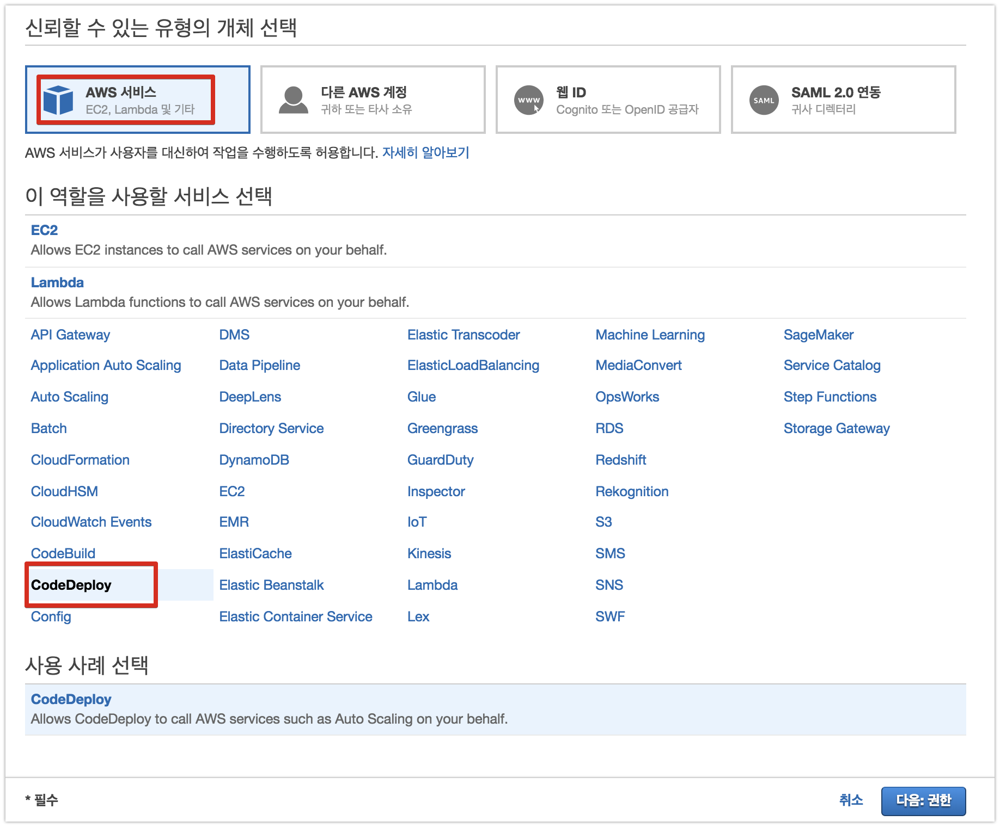

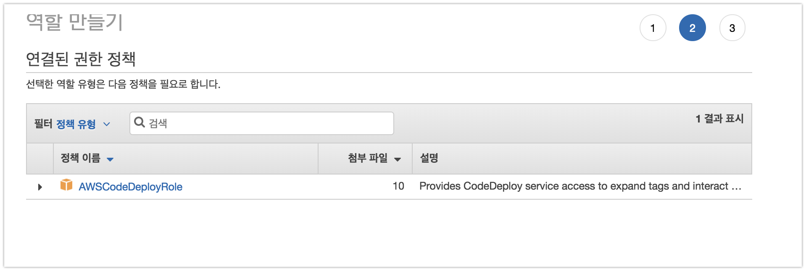

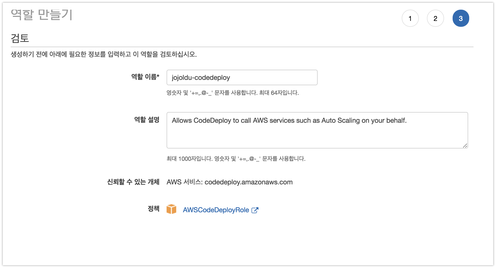

마지막 생성까지 끝나시면, **신뢰할 수 있는 객체로 codedeploy를 가진** 역할이 하나 생성된 것을 확인할 수 있습니다.

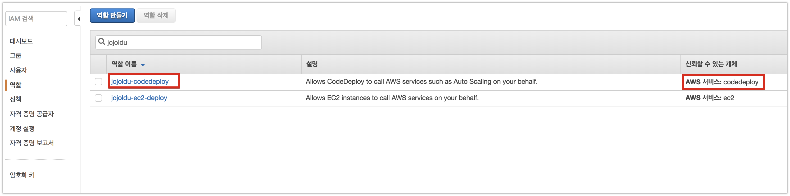

### 1-5-2. Code Deploy 생성

AWS 웹 콘솔에 접속하셔서 AWS Code Deploy로 이동합니다.


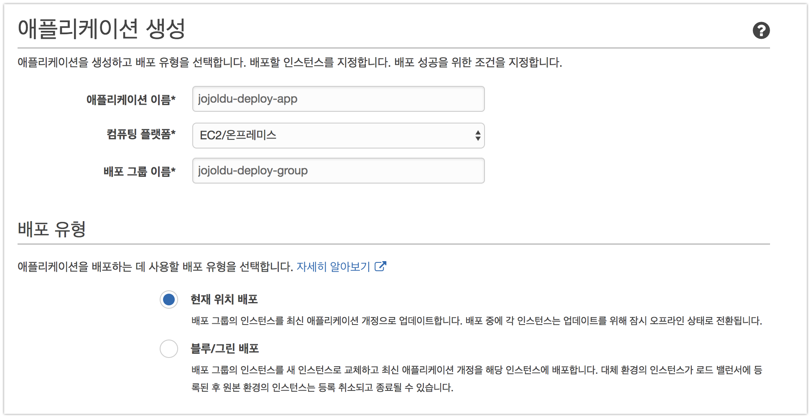

환경 구성은 일단 EC2 인스턴스로 합니다.  
(앞으로의 과정에서 오토스케일링 그룹 배포로 전환될 예정입니다.)

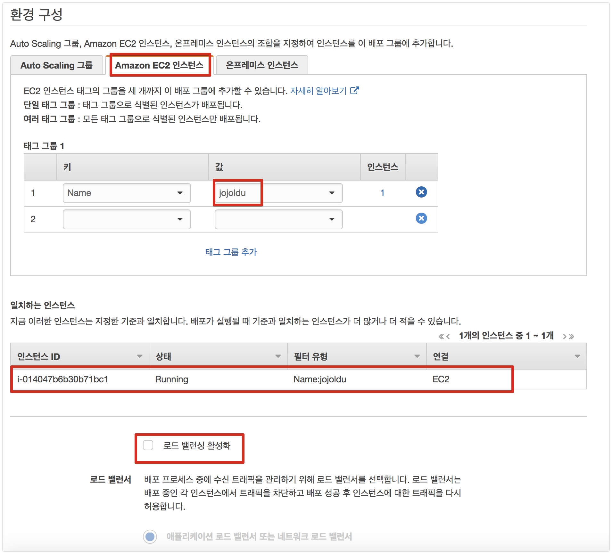

여기서 서비스 역할을 보시면, IAM Role을 선택해야하는데요.  
1-5-1에서 생성한 **Code Deploy용 Role**을 선택합니다.  
(EC2 Role이 아닙니다.)

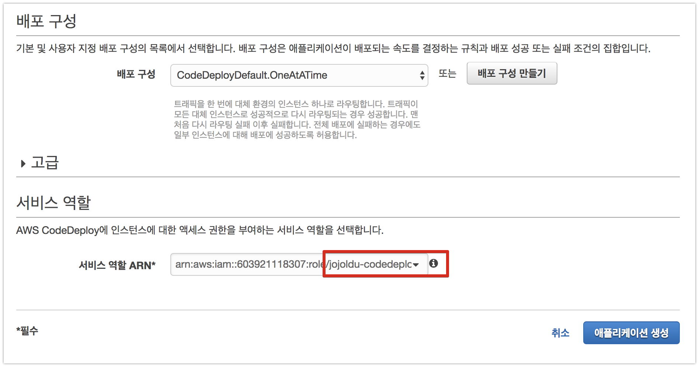

최종 생성이 완료되시면 아래와 같이 해당 그룹이 보입니다.

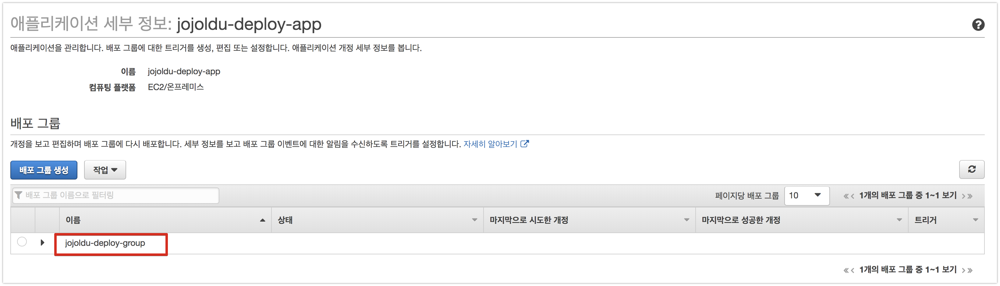

자 Code Deploy가 생성되었으니, 한번 실행해보겠습니다.

## 1-6. Code Deploy 실행하기

1-5에서 생성한 Code Deploy를 통해 실제 EC2에 배포를 진행해보겠습니다.  
배포 그룹을 선택하신뒤, **작업 -> 새 개정 배포**를 클릭합니다.

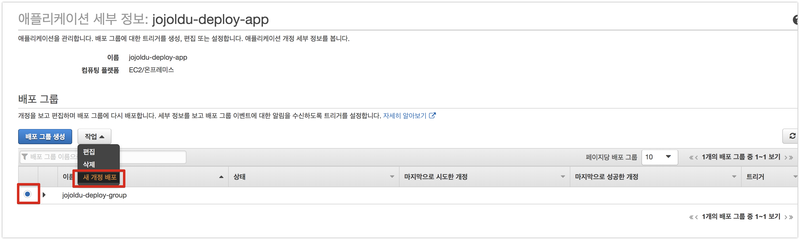

여기서 저희는 S3에 올라간 파일을 사용하지 않고, Github에서 바로 받아서 하도록 **Github**을 선택합니다.
선택하신뒤, 하단을 보시면 Github 계정 연결 창이 나오는데, 본인의 계정을 입력하시고 **Github에 연결** 버튼을 클릭합니다.

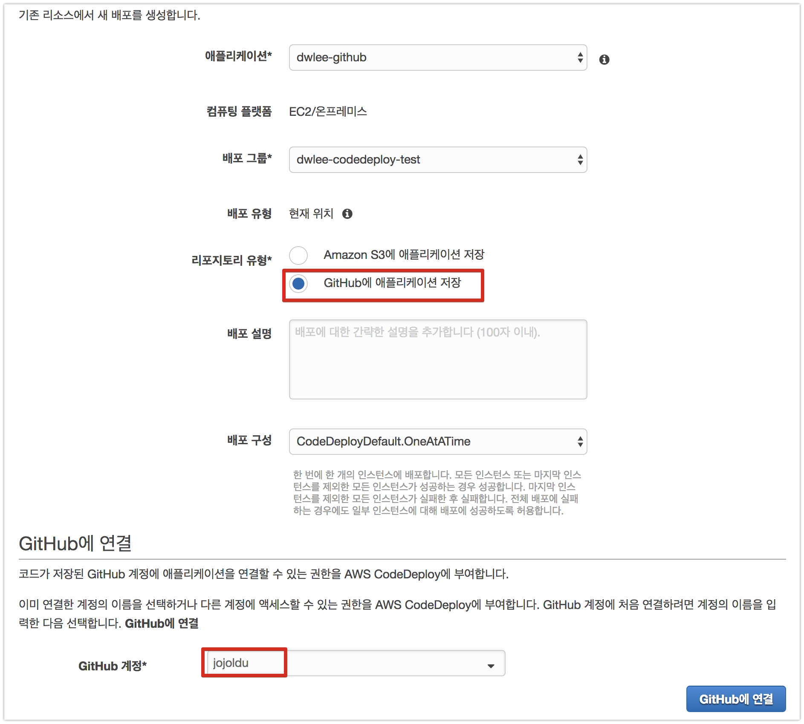

OAuth2가 자동으로 진행됩니다.


계정 연결이 성공하시면, 배포할 프로젝트의 Github의 커밋 히스토리로 갑니다.  
커밋 히스토리를 보시면 본인의 커밋 히스토리가 나오는데요.  
배포할 버전의 커밋 ID를 복사합니다.


복사한 커밋 ID와 저장소명을 Code Deploy에 등록합니다.  
나머지 옵션은 디폴트로 선택합니다.


다 끝나셨다면 **배포**를 클릭합니다.

> Code Deploy는 **CI의 기능이 없습니다**.  
즉, 지정된 위치의 파일을 전송하는 역할만 하기 때문에 CodeDeploy만 가지고는 이렇게 불편하게 하는데요.  
보통은 젠킨스 / Travis CI / AWS Code Build 등을 통해 빌드후, **빌드된 파일을 받도록** 합니다.  
이 과정은 차차 진행할 예정입니다.  
TravisCI + Code Deploy를 사용하는 방법이 궁금하시다면, [이전의 포스팅](http://jojoldu.tistory.com/265)을 참고하세요!

결과를 기다리시면!  
배포가 성공됐음을 확인할 수 있습니다.  
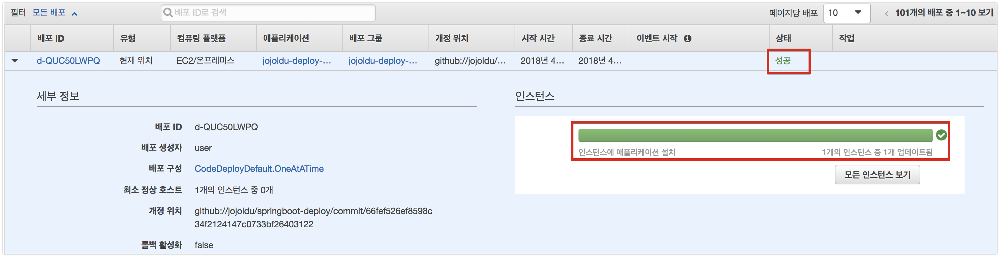

그럼 이제 본인의 EC2로 접속해서 Github에 올라간 프로젝트 파일들이 잘 도착했는지 확인합니다.  
짜잔!


Github에 올라간 파일들이 EC2에 성공적으로 도착했습니다.  

## 마무리

Code Deploy를 통해 Github에 올라간 파일들을 EC2에 전달하는 기능을 구현해봤습니다.  
하지만 이게 실제 배포라고 하기엔 무리가 있죠?  
현재 포스팅에선 다음의 과정들이 생략 되었습니다.  

* Gradle을 통해 Build 과정 누락
  * 빌드된 Jar파일 생성 과정 필요
* 빌드된 Jar를 통해 스프링부트 자동 실행
  * 기존 실행중인 스프링부트가 있다면 종료후, 실행
* 자동으로 Github의 최신 버전을 배포 대상으로 지정
  * 현재는 커밋 ID로 배포 버전을 결정

자! 다음시간엔 이 문제들을 해결할 수 있도록 **Code Pipeline**을 사용하는 과정을 진행하겠습니다.  
감사합니다^^
