# 2. AWS Code Build로 빌드하기

[지난 시간](http://jojoldu.tistory.com/281)에 Code Deploy 사용하는 방법에 대해 설명드렸습니다.  
  
AWS와 같은 클라우드 서비스가 등장하기전까지 IDC 환경에선 젠킨스 혹은 TravisCI와 같은 CI Tool에서 **Build & Test & Deploy를 다같이 처리**했었습니다.  
즉, Build & Test가 완료된 WAR/JAR 를 배포 서버로 바로 전송(```scp```)하여 배포했었습니다.  
하지만, AWS와 같이 오토 스케일링이 되는 클라우드 환경에선 트래픽에 따라 갑자기 서버가 늘었다/줄었다 할 수 있기 때문에 **배포서버 목록을 고정시키기가 어렵습니다**.  
(물론 AWS CLI에서 서버 리스트를 가져온다던가 할수도 있습니다)  
  
그래서 이런 문제를 **Code Deploy**를 통해 해결합니다.  
Code Deploy는 **ASG를 대상으로 배포가 가능**하기 때문인데요.  

> 제가 처음 ASG를 들었을때 배포가 어떻게 되는거지 라는 의문이 있었는데 Code Deploy로 ASG에 배포할 수 있다는걸 알게되서 의문이 해결됐습니다.

여기서 중요한 점은 "**그럼 빌드된 WAR/JAR를 어떻게 Code Deploy에 전달할 것인가**" 입니다.  
Code Deploy에서 배포할 파일을 가져오는 방법은 2가지가 있습니다.  

* Github
* S3

배포 파일(WAR/JAR)을 Github에 다시 올리는건 너무 이상합니다.  
그래서 보통은 **S3에 배포파일을 올리고 이를 Code Deploy에서 가져와서 EC2 혹은 ASG에 배포**하는게 기존의 AWS 배포 방식이였습니다.


이 방식으로 할 경우 개발자는 아래를 구축해야 합니다.

* 별도의 CI Tool 구축
* AWS CLI 스크립트 작성
  * 빌드파일 S3 업로드
  * Code Deploy 배포 

당장 서비스 만들기가 급한 상황에선 이런 작업들도 전부 공수가 들어가니, 쉽게 구축할 수 있는 방법이 필요합니다.  
그래서 AWS는 **Code Build**와  **Code Pipeline**를 제공합니다.

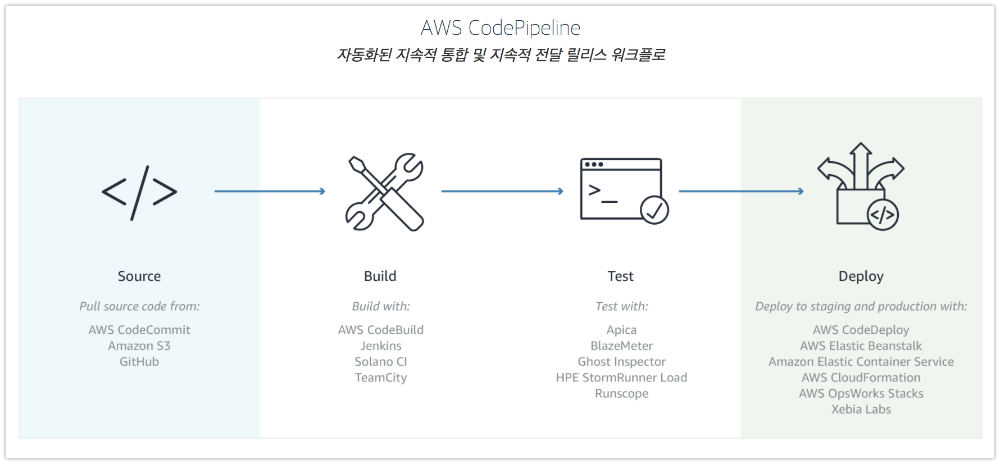

* [Code Build](https://aws.amazon.com/ko/codebuild/)
  * AWS가 제공하는 Build Tool
  * 지정된 위치에서 소스코드를 가져와 Build & Test 수행

* [Code Pipeline](https://aws.amazon.com/ko/codepipeline/)
  * AWS가 제공하는 통합 빌드 환경
  * 어느곳에서 소스코드를 가져오고, 어떤 툴을 통해 빌드하고, 어떤 툴을 통해 배포할지 전체 Flow를 관리

이번 시간엔 이 Code Build와 Code Pipeline을 이용해 배포환경을 구축해보겠습니다.  
전체 Flow는 아래와 같습니다.

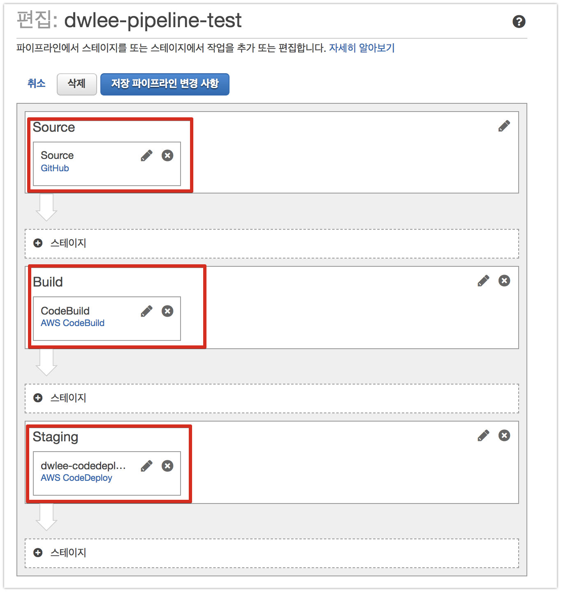

* Github에서 Source 코드를 가져오고
* Code Build를 통해 Build 해서
* Code Deploy를 통해 배포합니다.

자 그럼 이제 본격적으로 시작해보겠습니다!

> 저도 AWS Code Pipeline이 처음이다보니, 진행하다가 운영 배포환경에서 해결이 안되는 문제가 있다면 기존처럼 **젠킨스 CI + Code Deploy**로 배포하는 방식을 사용수도 있습니다.  

## 2-1. Code Build 구축하기

Code Build 부터 차례로 구축하겠습니다.  
Code Build 서비스로 이동하신뒤, **프로젝트 만들기** 버튼을 클릭합니다.

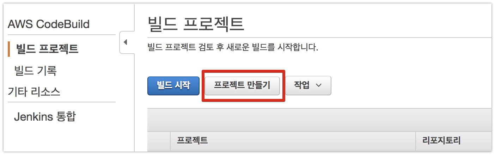

Github연결 버튼을 클릭합니다.

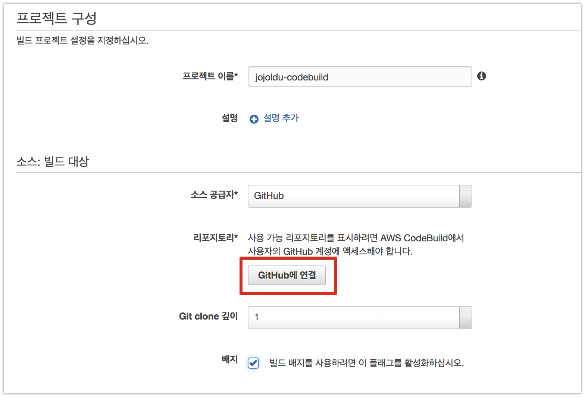

OAuth 인증을 하시고

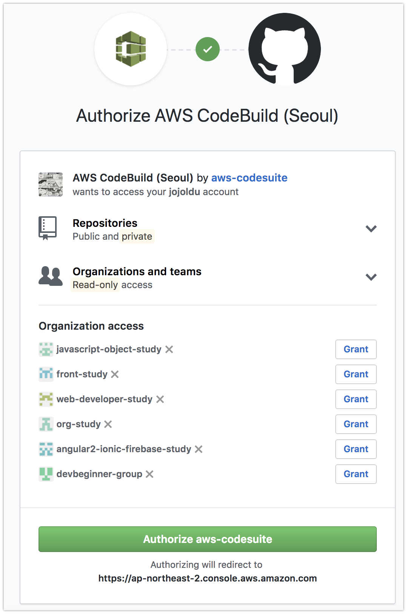

본인의 Github 저장소 URL을 등록합니다.  

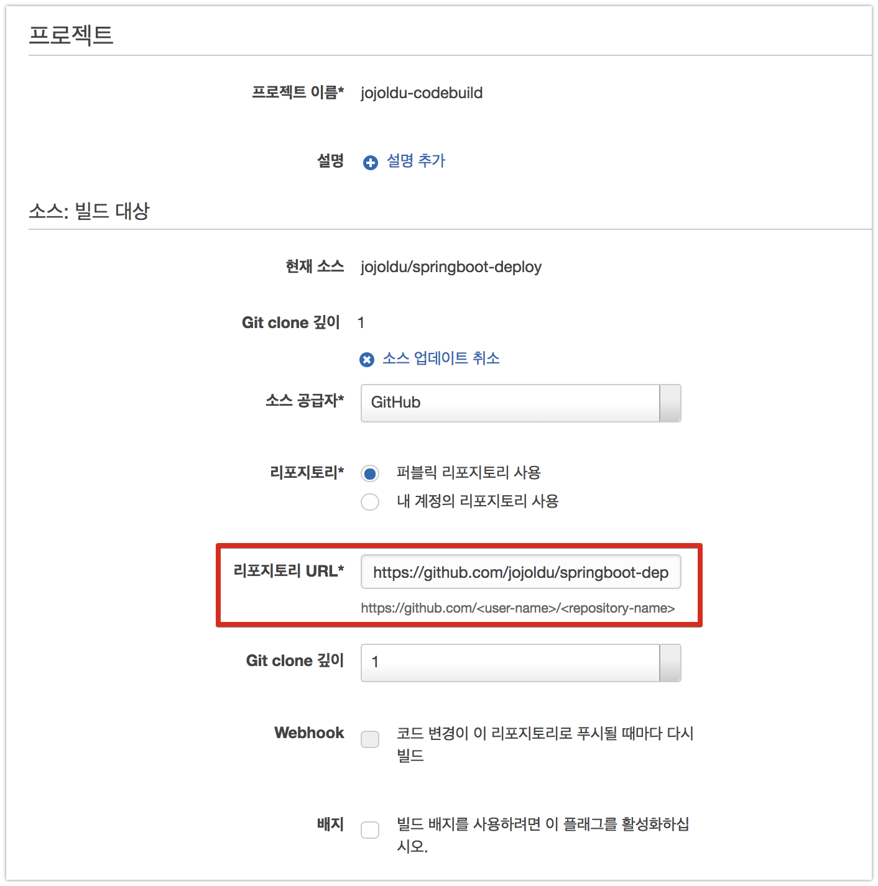

Java8의 빌드환경을 가질테니 Java8을 선택합니다.  
(현재 자바8과 9만 지원됩니다.)  
여기서 빌드를 어떤식으로 진행할지 선택하는 방법이 2가지있습니다.  

* buildspec.yml
* code build 편집창에서 직접 커맨드 추가

보편적으로 이런 인프라 환경은 **코드로 관리**하는걸 추천합니다.  
(코드로 관리하게 되면, Git을 통해 이전에 설정한 값을 다시 찾기도 쉬울뿐더러, 누가 어떤 사유로 수정했는지도 추적하기 쉽습니다.  
또한, Code Build 설정이 삭제됐다하더라도, 코드에 그대로 남아있어 재설정하기가 굉장히 편리합니다.)  
여기서도 마찬가지로 buildspec.yml로 코드관리를 진행하겠습니다.

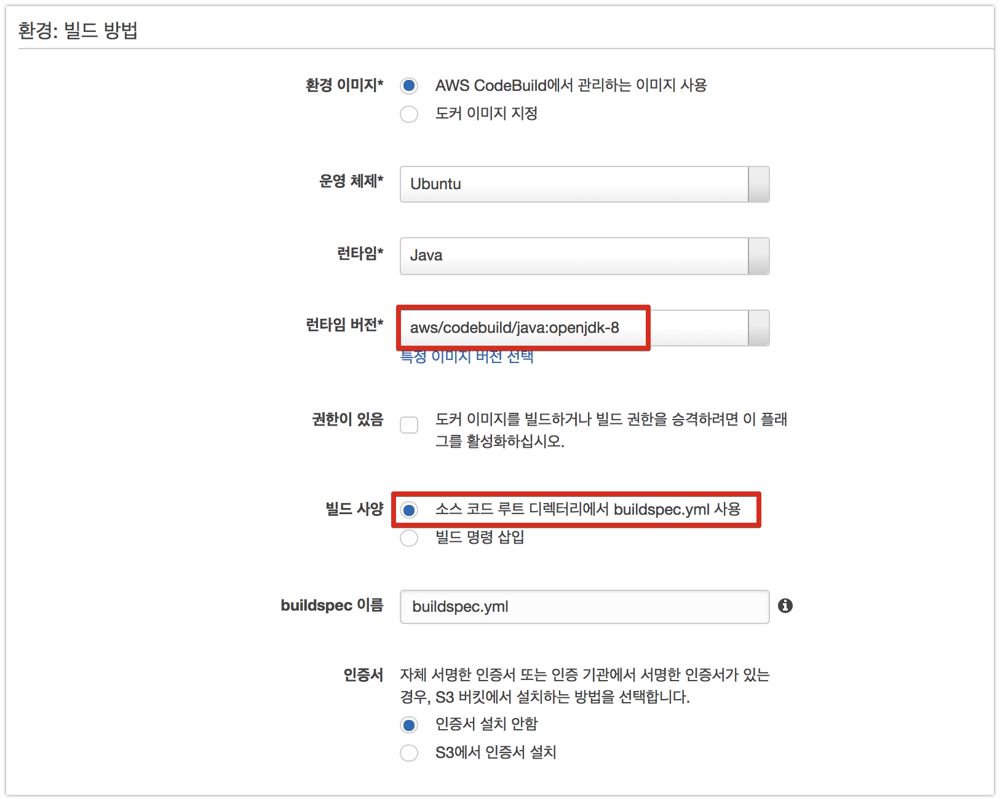

미리 생성한 S3 버킷 정보를 입력합니다.
(참고로 버킷 목록에 본인의 버킷이 보이지 않는다면, 다시 Code Build 생성 페이지로 들어와 보세요.  
목록 갱신이 실시간이 아니라서 생성 페이지로 이동할때만 다시 불러옵니다.)  


* 아티팩트
  * 빌드된 WAR/JAR를 보관할 위치를 나타냅니다.
* 캐시
  * 빌드에 필요한 의존성들을 캐시
  * Maven/Gradle을 사용할 경우 필요한 라이브러리를 다운 받아야하는데요.
  * 이 파일들을 빌드할때마다 새로 받는게 아니라, 한번 받은 내용들은 S3에 올려놓고 빌드시에는 이미 받은 내용을 다시 받지 않도록 *캐시**하는 역할을 합니다.

미리 생성한 S3는 다음과 같습니다.


IAM Role의 경우 여기서 즉시 생성합니다.


그럼 Code Build가 생성되었습니다!  

## 2-2. Code Build 실행하기

방금 생성한 Code Build를 선택하고 **빌드 시작**버튼을 클릭합니다.


기본값으로 두고 바로 빌드시작을 하면 되는데요.  
여기서 잠깐!


buildspec.yml이 아직 프로젝트에 추가되지 않았기 때문에 해당 파일을 추가하겠습니다.  
프로젝트 안에 ```buildspec.yml```파일을 생성하고 아래와 같이 코드를 추가합니다.

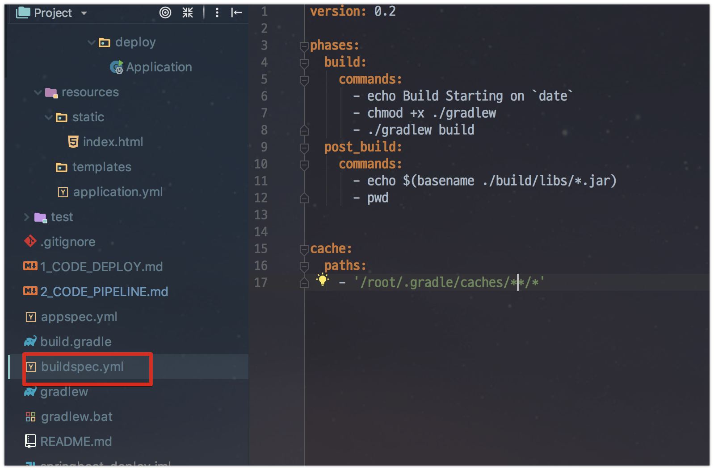

```yml
version: 0.2

phases:
  build:
    commands:
      - echo Build Starting on `date`
      - chmod +x ./gradlew
      - ./gradlew build
  post_build:
    commands:
      - echo $(basename ./build/libs/*.jar)
      - pwd

cache:
  paths:
    - '/root/.gradle/caches/**/*'
```

* phases.build
  * 프로젝트 빌드 시점입니다.
  * 여기서는 ```chmod +x ./gradlew```를 통해 gradlew에 실행권한을 추가하고,
  * ```./gradlew build```로 build를 수행합니다.

* phases.post_build
  * phases.build가 끝난 후에 실행되는 시점입니다.
  * 현재는 딱히 할게 없기 때문에 **빌드 결과물을 노출**시키는 명령어만 추가합니다.
* cache.paths
  * 여기에 지정된 위치의 파일들을 S3에 캐시파일로 등록합니다.
  * gradle의 경우 ```/root/.gradle/caches/**/*```에 다운받은 의존성 파일들이 있기 때문에 이 위치를 캐시영역으로 지정합니다.
  * maven: ```'/root/.m2/**/*'```
  * 그 외 Path [참고](https://aws.amazon.com/ko/blogs/devops/how-to-enable-caching-for-aws-codebuild/)

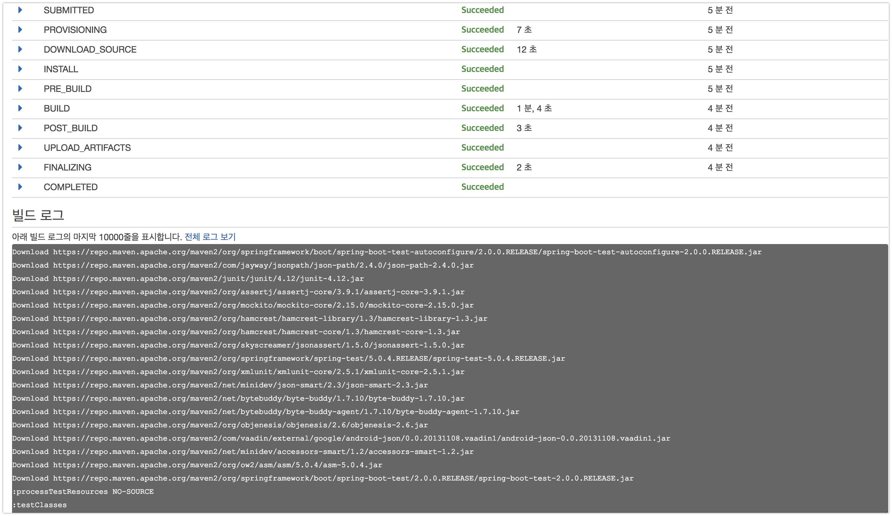

(Build가 **1분 4초**가 소모된걸 확인할 수 있습니다.)  
  
Build 로그를 보시면 원하던대로 커맨드가 실행되서 로그 출력 되는걸 확인할 수 있습니다.

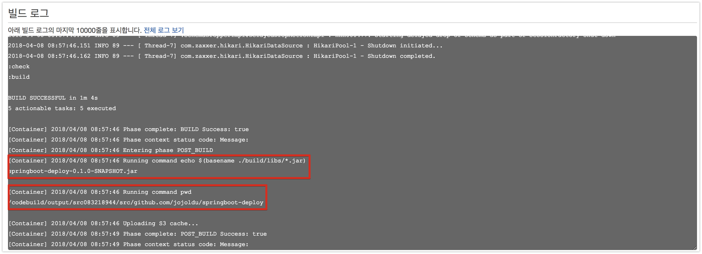

자 Build가 정상적으로 수행되는건 확인되었습니다.  
그럼 캐시 기능이 잘 되는지 한번 확인해보겠습니다.  
빌드 화면 위를 보시면 **재시도**버튼이 있습니다.  
재시도 해봅니다.

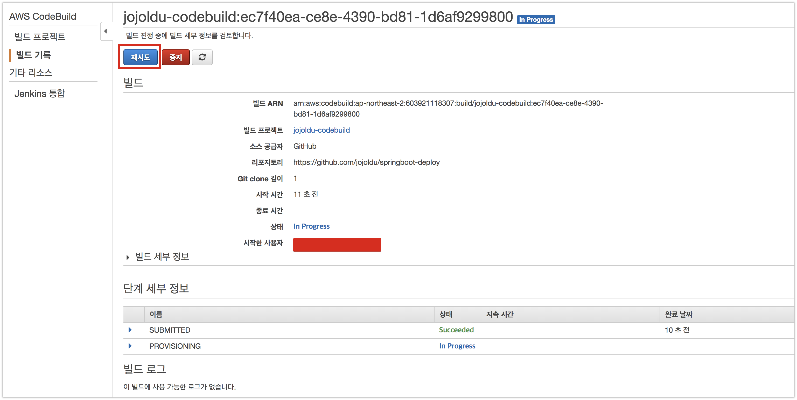

재시로 로그를 보시면 기존에 받던 의존성들을 더이상 받지 않고 S3에서 파일을 하나 받아 ```unzip``` 하는걸 알 수 있습니다.  

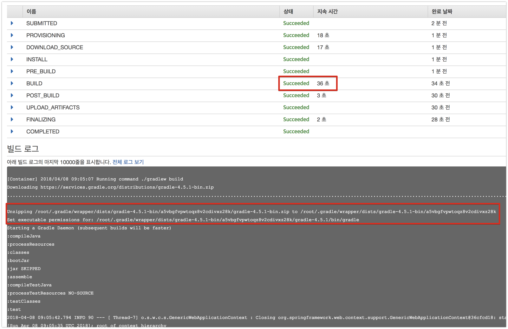

실제로 Build 수행 시간도 1분이 넘던 것이 **36초로 대폭 개선**된 것을 볼 수 있습니다.  
  
Code Deploy와 Code Build를 모두 생성해봤습니다!  
다음 시간에는 **Code Pipeline**으로 이들을 연결해보겠습니다.  

