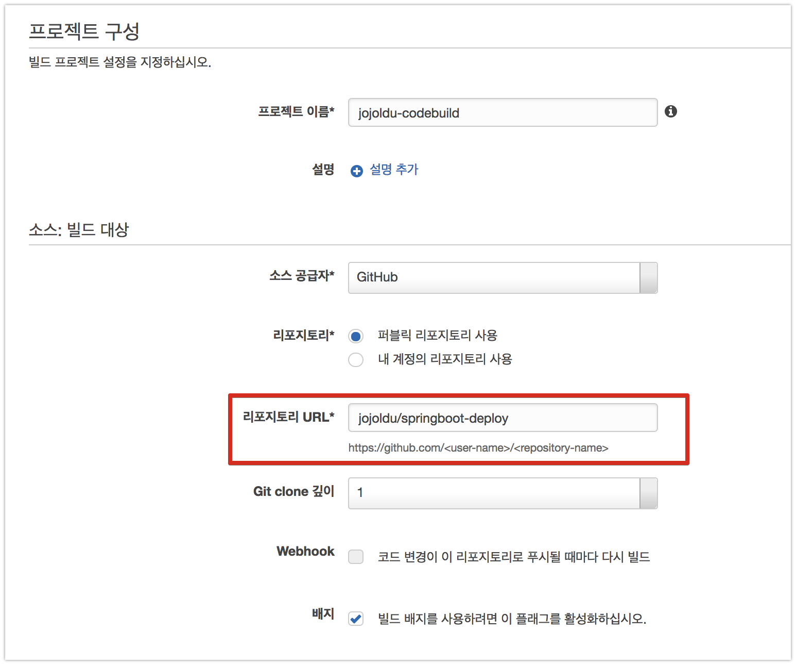

# 2. AWS Code Pipeline으로 배포하기

[지난 시간](http://jojoldu.tistory.com/281)에 Code Deploy 사용하는 방법에 대해 설명드렸습니다.  
  
AWS와 같은 클라우드 서비스가 등장하기전까지 IDC 환경에선 젠킨스 혹은 TravisCI와 같은 CI Tool에서 **Build & Test & Deploy를 다같이 처리**했었습니다.  
즉, Build & Test가 완료된 WAR/JAR 를 배포 서버로 바로 전송(```scp```)하여 배포했었습니다.  
하지만, AWS와 같이 오토 스케일링이 되는 클라우드 환경에선 트래픽에 따라 갑자기 서버가 늘었다/줄었다 할 수 있기 때문에 **배포서버 목록을 고정시키기가 어렵습니다**.  
(물론 AWS CLI에서 서버 리스트를 가져온다던가 할수도 있습니다)  
  
그래서 이런 문제를 **Code Deploy**를 통해 해결합니다.  
Code Deploy는 **ASG를 대상으로 배포가 가능**하기 때문인데요.  

> 제가 처음 ASG를 들었을때 배포가 어떻게 되는거지 라는 의문이 있었는데 Code Deploy로 ASG에 배포할 수 있다는걸 알게되서 의문이 해결됐습니다.

여기서 중요한 점은 "**그럼 빌드된 WAR/JAR를 어떻게 Code Deploy에 전달할 것인가**" 입니다.  
Code Deploy에서 배포할 파일을 가져오는 방법은 2가지가 있습니다.  

* Github
* S3

배포 파일(WAR/JAR)을 Github에 다시 올리는건 너무 이상합니다.  
그래서 보통은 **S3에 배포파일을 올리고 이를 Code Deploy에서 가져와서 EC2 혹은 ASG에 배포**하는게 기존의 AWS 배포 방식이였습니다.


개발자는 아래를 구축해야만 합니다.

* 별도의 CI Tool 구축
* AWS CLI 스크립트 작성
  * 빌드파일 S3 업로드
  * Code Deploy 배포 

당장 서비스 만들기가 급한 상황에선 이런 작업들도 전부 공수가 들어가니, 쉽게 구축할 수 있는 방법이 필요합니다.  
그래서 AWS는 **Code Build**와  **Code Pipeline**를 제공합니다.


* [Code Build](https://aws.amazon.com/ko/codebuild/)
  * AWS가 제공하는 Build Tool
  * 지정된 위치에서 소스코드를 가져와 Build & Test 수행

* [Code Pipeline](https://aws.amazon.com/ko/codepipeline/)
  * AWS가 제공하는 통합 빌드 환경
  * 어느곳에서 소스코드를 가져오고, 어떤 툴을 통해 빌드하고, 어떤 툴을 통해 배포할지 전체 Flow를 관리

이번 시간엔 이 Code Build와 Code Pipeline을 이용해 배포환경을 구축해보겠습니다.  
전체 Flow는 아래와 같습니다.


* Github에서 Source 코드를 가져오고
* Code Build를 통해 Build 해서
* Code Deploy를 통해 배포합니다.

자 그럼 이제 본격적으로 시작해보겠습니다!

> 저도 AWS Code Pipeline이 처음이다보니, 진행하다가 운영 배포환경에서 해결이 안되는 문제가 있다면 기존처럼 **젠킨스 CI + Code Deploy**로 배포하는 방식을 사용수도 있습니다.  

## 2-1. Code Build 구축하기

Code Build 부터 차례로 구축하겠습니다.  
Code Build 서비스로 이동하신뒤, **프로젝트 만들기** 버튼을 클릭합니다.




