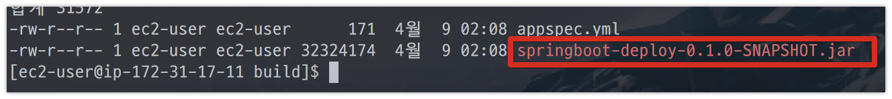
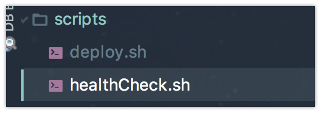
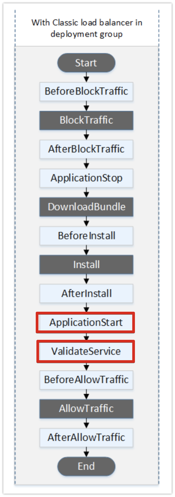
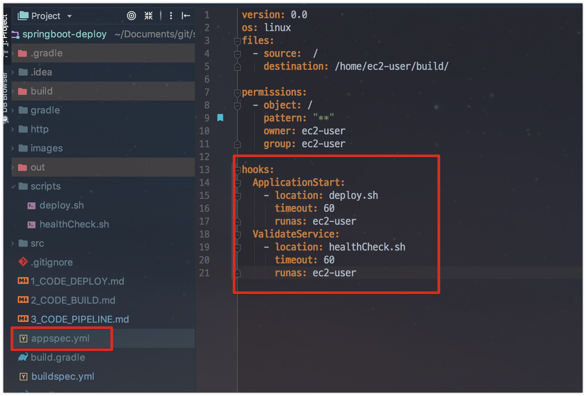
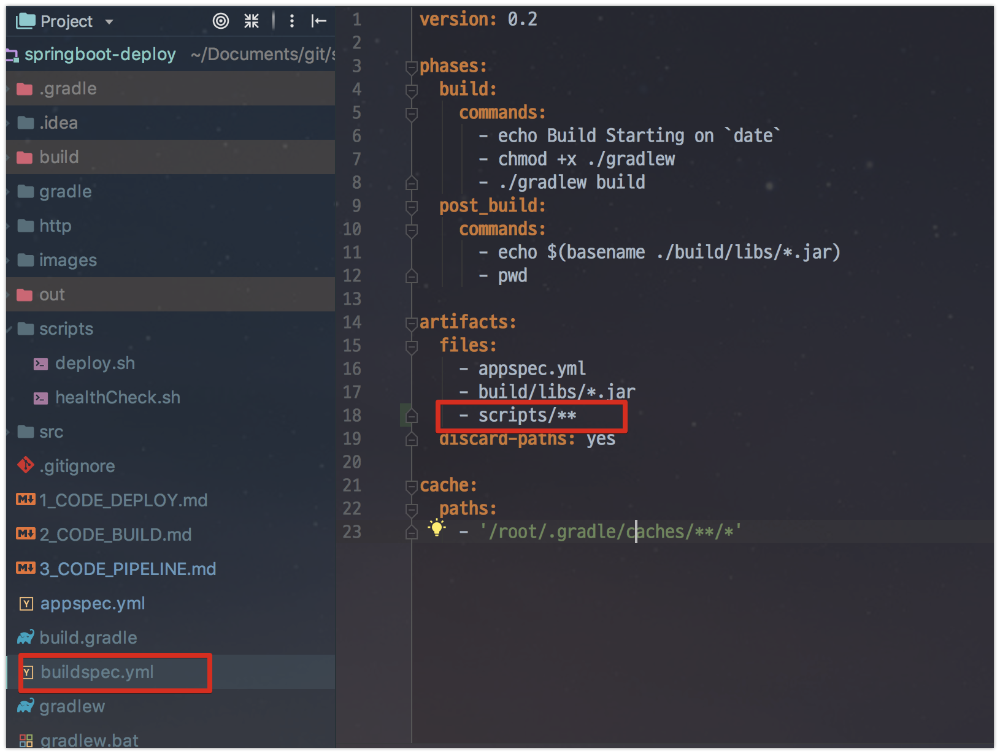
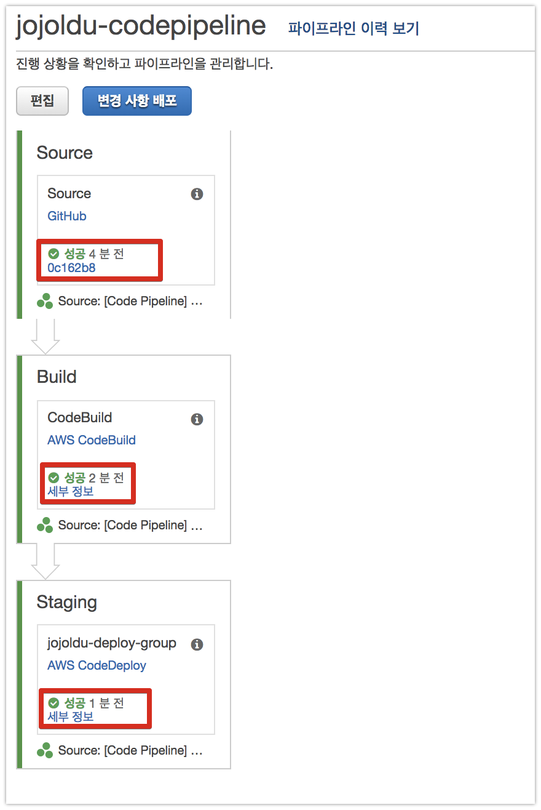
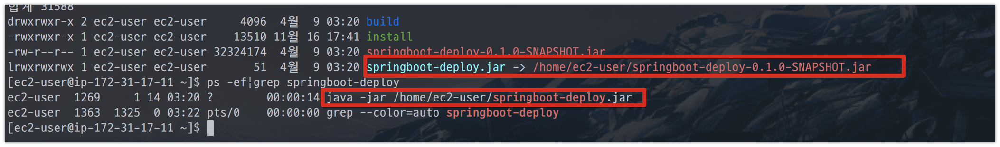
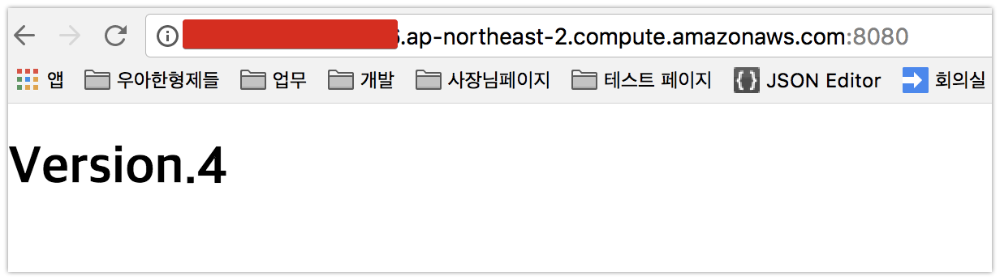

# 3. AWS Code Pipeline으로 배포하기

이번 시간에는 앞서 진행된 [Code Deploy](http://jojoldu.tistory.com/281), [Code Build](http://jojoldu.tistory.com/282)를 Code Pipeline에서 통합해서 사용하는 방법을 소개 드리겠습니다.

> 모든 코드는 [Github](https://github.com/jojoldu/springboot-deploy)에 있으니 참고 바랍니다

## 3-1. Code Pipeline 구축하기

먼저 Code Pipeline 웹콘솔로 이동합니다.  
**파이프라인 생성**버튼을 클릭합니다.


Code Pipeline 이름을 등록합니다.


소스를 Github에 가져오도록 선택하고, **Github에 연결**을 클릭합니다.


OAuth 리다이렉트가 끝나면 리포지토리와 브랜치를 선택합니다.


여기서 고급을 보면 실행 트리거가 2개가 있습니다.  

* master 브랜치에 PUSH 발생시 자동 실행
* 파이프라인 수동 실행

이번 포스팅에선 **수동 실행**을 선택하겠습니다.  


기존에 등록한 Code Deploy를 선택합니다.


Code Build와 마찬가지로 필요한 IAM Role을 여기서 바로 생성하겠습니다.


IAM Role 생성이 끝나면 자동으로 등록됩니다.


최종적으로 본인이 지정한 스펙을 검토하신뒤 생성합니다.


배포하기 전에 Code Deploy로 채워진 ```~/build/``` 디렉토리를 싹 비우겠습니다.

```bash
sudo rm -rf ~/build/*
```


자 현재 ```~/build/``` 에는 아무것도 없습니다.  
배포가 완료되면 배포 파일들이 있겠죠?  
그럼 배포를 진행해볼텐데요.  
그전에! Code Build & Code Deploy을 연계하기 위해 각각의 yml들을 수정하겠습니다.  
먼저  ```buildspec.yml```을 수정하겠습니다.


```yml
version: 0.2

phases:
  build:
    commands:
      - echo Build Starting on `date`
      - chmod +x ./gradlew
      - ./gradlew build
  post_build:
    commands:
      - echo $(basename ./build/libs/*.jar)
      - pwd

artifacts:
  files:
    - appspec.yml
    - build/libs/*.jar
  discard-paths: yes

cache:
  paths:
    - '/root/.gradle/caches/**/*'
```

여기서 변경된건 2가지입니다.

* artifacts.files
  * S3로 업로드할 대상을 지정합니다.
  * 여기서 지정된 파일들이 zip파일로 되어 S3로 업로드 됩니다.
  * jar외에 appspec.yml도 추가된 이유는, Code Deploy때문입니다.
  * **Code Build가 끝난후, Code Deploy를 실행시키기 위해** 빌드 파일 목록에 appspec.yml도 추가해야만 합니다.
* artifacts.discard-paths
  * 파일의 Path를 버리고 파일만 가져갈지를 선택합니다.
  * 예)```build/libs/*.jar```
      * 디폴트: ```/home/ec2-user/build/build/libs/springboot-deploy.jar```가 생성
      * ```yes:```: ```/home/ec2-user/build/springboot-deploy.jar```로 생성
      * yes로 할 경우엔 해당 파일만 바라보기 때문

Code Deploy 배포 스펙을 결정하는 appspec.yml로 수정합니다.


```yml
version: 0.0
os: linux
files:
  - source:  /
    destination: /home/ec2-user/build/

permissions:
  - object: /
    pattern: "**"
    owner: ec2-user
    group: ec2-user
```

여기서 추가된건 1가지입니다.  
바로 ```permissions```입니다.  
이게 없다면 code deploy로 전달되는 파일들의 **사용자/그룹이 모두 root**로 됩니다.  
ec2의 기본 사용자가 ec2-user이기 때문에 배포파일들도 모두 ec2-user에 권한이 있도록 변경합니다.  
자 그럼 이제 Code Pipeline으로 배포를 해보겠습니다.  


Code Deploy까지 성공적으로 끝나면 본인의 EC2로 접속해서 build 디렉토리에 배포파일들이 있는지 확인해봅니다.


ec2-user 사용자로 appspec.yml과 jar파일이 있는것이 확인됩니다!  
여기서 한가지 이상한게 있는데요.  
jar명이 springboot-deploy (프로젝트명)이 아닌 **src로 되어있는 것**입니다.  
이유를 파악하기 위해 Code Build 로그를 보겠습니다.


Code Build가 Github에서 바로 코드를 가져올때와 달리, Code Pipeline에서 Code Build로 소스코드를 넣어서 실행할때는 **src라는 임시 디렉토리**를 생성해서 실행합니다.  
Gradle에서 별도로 jar명을 지정안했기 때문에 프로젝트 **코드가 있는 디렉토리명이 jar명**이 되어 src라는 jar가 생성된 것입니다.  
이를 해결하기 위해 **build.gradle**에 jar명을 강제지정하겠습니다.  

```groovy
archivesBaseName = 'springboot-deploy'
```


다시 배포를 실행해봅니다.



원하던 프로젝트명으로 Jar가 생성되어서 전달되었음을 확인할 수 있습니다!

## 3-2. Code Pipeline으로 스프링부트 실행하기

자 이제 Code Pipeline으로 빌드된 Jar를 EC2에 전송하는것까지가 완성되었습니다.  
배포가 여기서 끝이 아니죠?  
결국 **서버에서 배포된 Jar를 자동 실행**하고, 잘 **실행되었는지 체크**까지 되야만 합니다.  
이 부분 역시 AWS 내부에서 해결하지 않고, 코드로 해결해보겠습니다.  
먼저 프로젝트 내부에 ```scripts```라는 디렉토리를 생성합니다.  
그리고 이 디렉토리 안에 2개의 쉘 스크립트 파일을 생성합니다.

* deploy.sh
  * 배포된 스프링부트 Jar를 실행시킬 스크립트
* healthCheck.sh
  * 스프링부트 Jar가 잘 수행되었는지 확인하는 스크립트




각각의 스크립트 코드는 아래와 같습니다.  
  
**deploy.sh**

```bash
#!/bin/bash
BUILD_PATH=$(ls /home/ec2-user/build/*.jar)
JAR_NAME=$(basename $BUILD_PATH)
echo "> build 파일명: $JAR_NAME"

echo "> build 파일 복사"
DEPLOY_PATH=/home/ec2-user/
cp $BUILD_PATH $DEPLOY_PATH

echo "> springboot-deploy.jar 교체"
CP_JAR_PATH=$DEPLOY_PATH$JAR_NAME
APPLICATION_JAR_NAME=springboot-deploy.jar
APPLICATION_JAR=$DEPLOY_PATH$APPLICATION_JAR_NAME

ln -Tfs $CP_JAR_PATH $APPLICATION_JAR

echo "> 현재 실행중인 애플리케이션 pid 확인"
CURRENT_PID=$(pgrep -f $APPLICATION_JAR_NAME)

if [ -z $CURRENT_PID ]
then
  echo "> 현재 구동중인 애플리케이션이 없으므로 종료하지 않습니다."
else
  echo "> kill -15 $CURRENT_PID"
  kill -15 $CURRENT_PID
  sleep 5
fi

echo "> $APPLICATION_JAR 배포"
nohup java -jar $APPLICATION_JAR > /dev/null 2> /dev/null < /dev/null &
```

**healthCheck.sh**

```bash
#!/bin/bash
echo "> Health check 시작"
echo "> curl -s http://localhost:8080/actuator/health "

for RETRY_COUNT in {1..15}
do
  RESPONSE=$(curl -s http://localhost:8080/actuator/health)
  UP_COUNT=$(echo $RESPONSE | grep 'UP' | wc -l)

  if [ $UP_COUNT -ge 1 ]
  then # $up_count >= 1 ("UP" 문자열이 있는지 검증)
      echo "> Health check 성공"
      break
  else
      echo "> Health check의 응답을 알 수 없거나 혹은 status가 UP이 아닙니다."
      echo "> Health check: ${RESPONSE}"
  fi

  if [ $RETRY_COUNT -eq 10 ]
  then
    echo "> Health check 실패. "
    exit 1
  fi

  echo "> Health check 연결 실패. 재시도..."
  sleep 10
done
exit 0
```

이 스크립트들은 Code Deploy로 배포파일을 받은 후에 실행되어야 합니다.  

AWS Code Deploy의 Hooks 시점은 아래와 같습니다.  
(여기서 회식 표시된 시점은 사용자가 커스텀하게 Hook처리를 할수 없습니다.)  



여기서 Install이 전달받은 Zip 파일을 푸는 시점입니다.  
즉, Jar를 실행하고, 검증하는 부분은 이 이후 시점에 진행되어야하는데요.  
권장하는 시점은

* 프로젝트 실행: ApplicationStart
* 검증: ValidateService

입니다.  
  
그래서 2개의 스크립트 실행시점을 appspec.yml에 설정하겠습니다.



```yml
version: 0.0
os: linux
files:
  - source:  /
    destination: /home/ec2-user/build/

permissions:
  - object: /
    pattern: "**"
    owner: ec2-user
    group: ec2-user

hooks:
  ApplicationStart:
    - location: deploy.sh
      timeout: 60
      runas: ec2-user
  ValidateService:
    - location: healthCheck.sh
      timeout: 60
      runas: ec2-user
```

그리고 scripts 디렉토리도 Code Build 대상에 포함되도록 buildspec.yml도 수정합니다.



```yml
version: 0.2

phases:
  build:
    commands:
      - echo Build Starting on `date`
      - chmod +x ./gradlew
      - ./gradlew build
  post_build:
    commands:
      - echo $(basename ./build/libs/*.jar)
      - pwd

artifacts:
  files:
    - appspec.yml
    - build/libs/*.jar
    - scripts/** 
  discard-paths: yes

cache:
  paths:
    - '/root/.gradle/caches/**/*'
```

이렇게 수정후 PUSH 한뒤에 다시 배포를 해보겠습니다.  



배포가 성공적으로 진행된 후, EC2 에서 확인해보시면 스프링부트 프로젝트가 정상적으로 실행되어있음을 알 수 있습니다.



자 그럼 실제로 브라우저에서 접속해보시면!



정상적으로 프로젝트가 실행되어서 호스팅되고 있습니다!  
  
**Code Pipeline으로 배포 환경을 구축**해봤습니다!  
여기까지 과정은 하나의 EC2에 배포하는 과정이였습니다.  
다음 시간엔 **EC2 배포에서 ASG(Auto Scaling Group) 배포로 확장**하는 방법을 소개드리겠습니다.  
감사합니다^^
