# 3. AWS Code Pipeline으로 배포하기

이번 시간에는 앞서 진행된 [Code Deploy](http://jojoldu.tistory.com/281), [Code Build](http://jojoldu.tistory.com/282)를 Code Pipeline에서 통합해서 사용하는 방법을 소개 드리겠습니다.

> 모든 코드는 [Github](https://github.com/jojoldu/springboot-deploy)에 있으니 참고 바랍니다

## 3-1. Code Pipeline 구축하기

먼저 Code Pipeline 웹콘솔로 이동합니다.  
**파이프라인 생성**버튼을 클릭합니다.

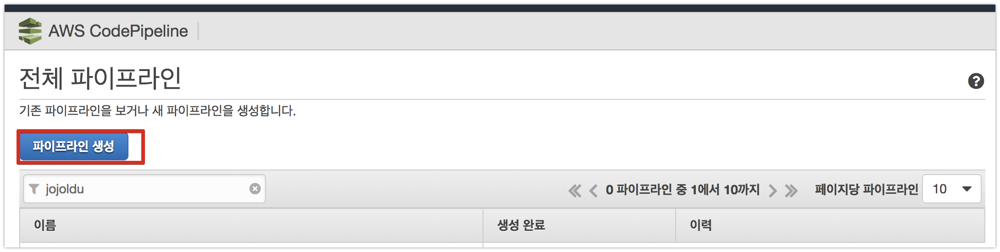

Code Pipeline 이름을 등록합니다.

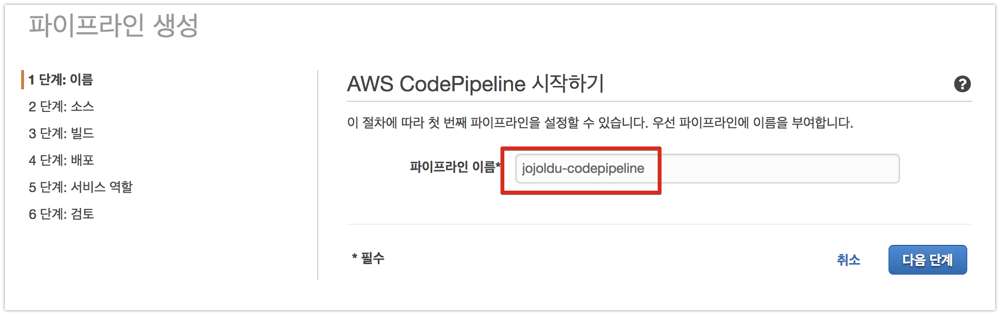

소스를 Github에 가져오도록 선택하고, **Github에 연결**을 클릭합니다.

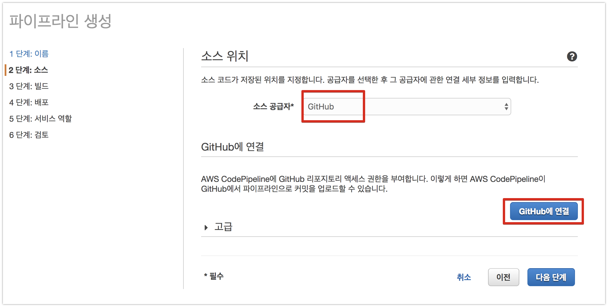

OAuth 리다이렉트가 끝나면 리포지토리와 브랜치를 선택합니다.

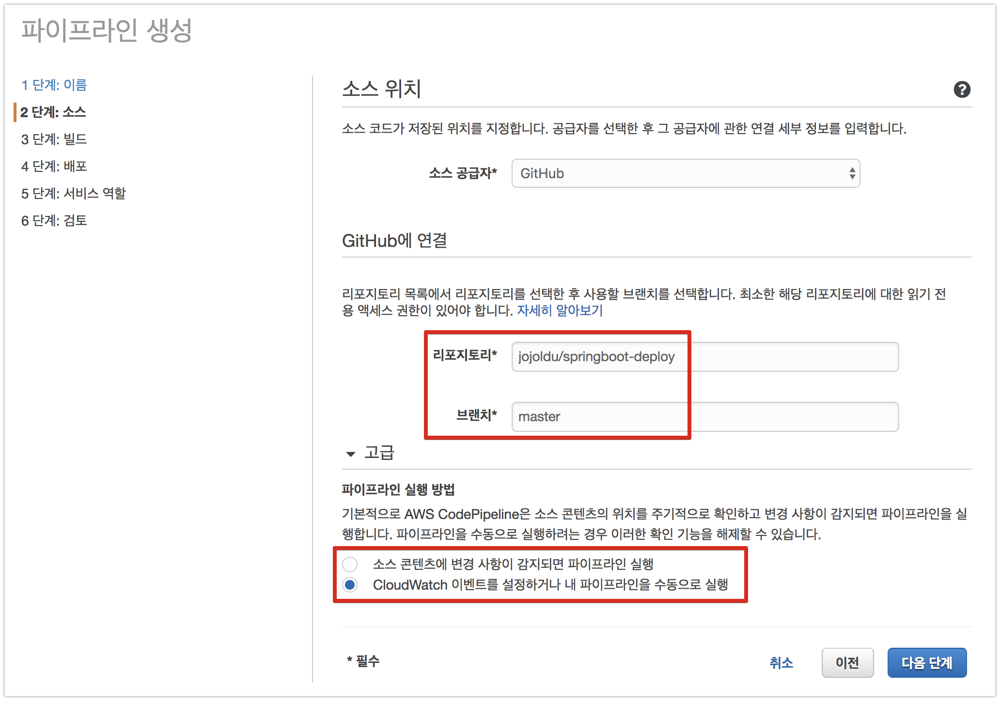

여기서 고급을 보면 실행 트리거가 2개가 있습니다.  

* master 브랜치에 PUSH 발생시 자동 실행
* 파이프라인 수동 실행

이번 포스팅에선 **수동 실행**을 선택하겠습니다.  

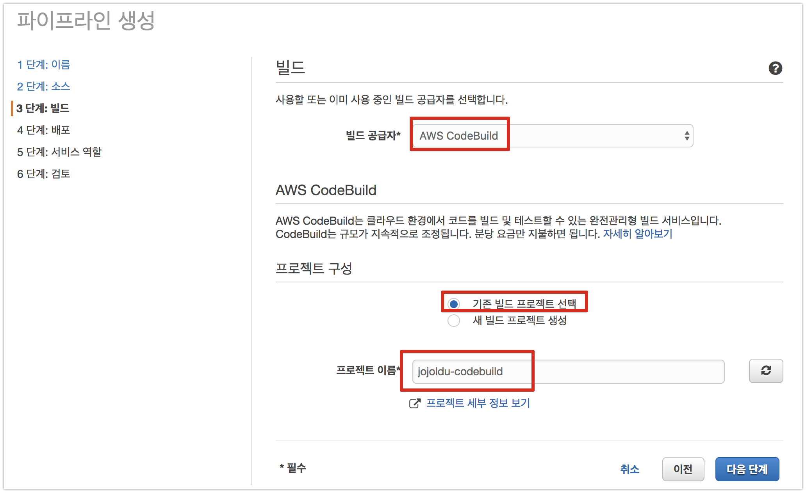

기존에 등록한 Code Deploy를 선택합니다.

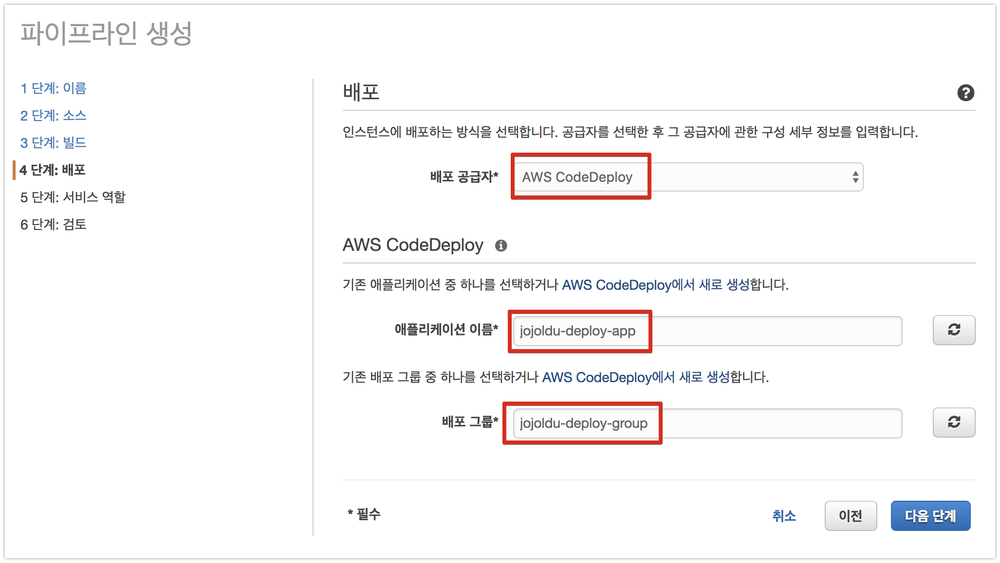

Code Build와 마찬가지로 필요한 IAM Role을 여기서 바로 생성하겠습니다.

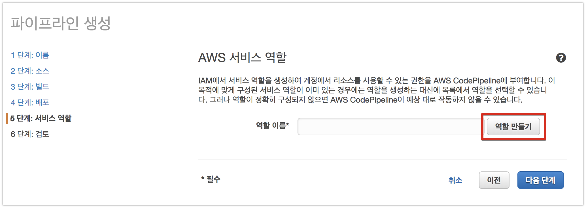

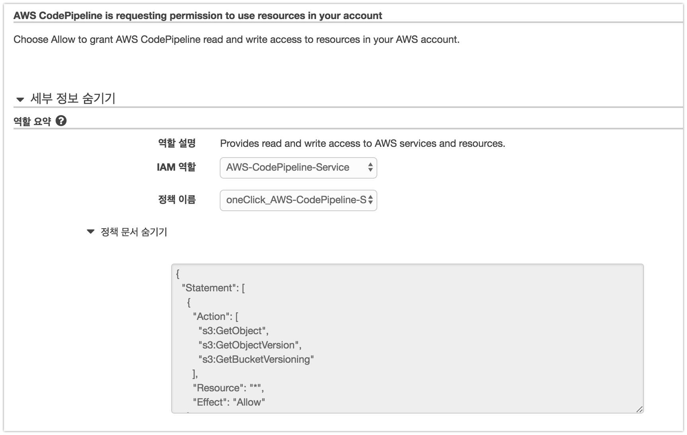

IAM Role 생성이 끝나면 자동으로 등록됩니다.

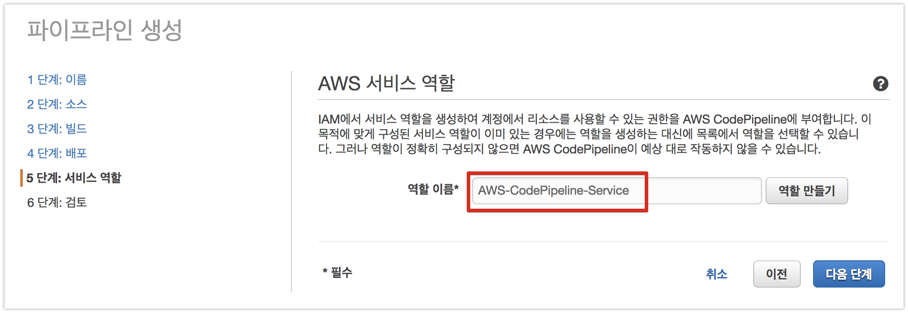

최종적으로 본인이 지정한 스펙을 검토하신뒤 생성합니다.

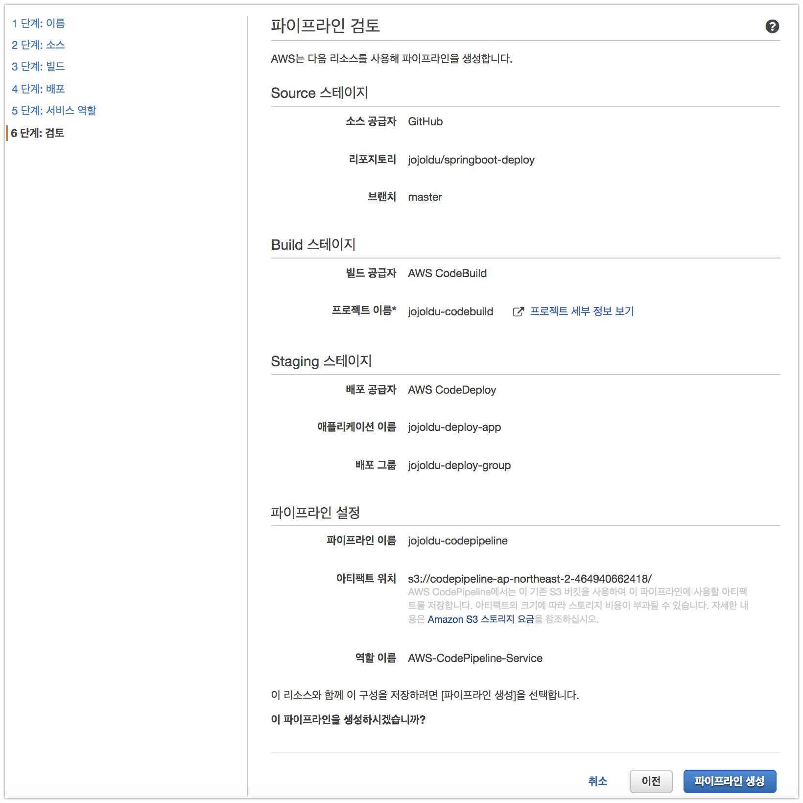

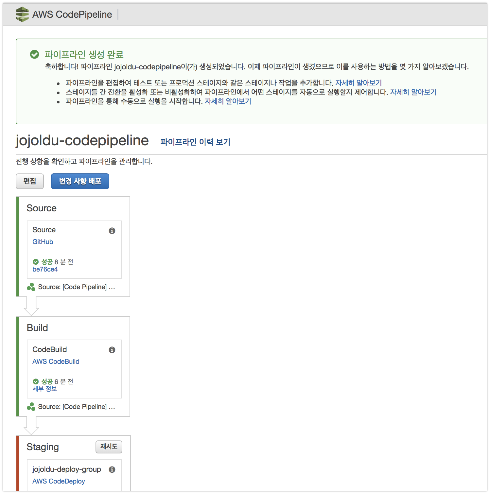

배포하기 전에 Code Deploy로 채워진 ```~/build/``` 디렉토리를 싹 비우겠습니다.

```bash
sudo rm -rf ~/build/*
```

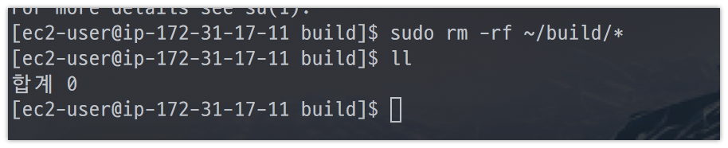

자 현재 ```~/build/``` 에는 아무것도 없습니다.  
배포가 완료되면 배포 파일들이 있겠죠?  
그럼 배포를 진행해볼텐데요.  
그전에! Code Build & Code Deploy을 연계하기 위해 각각의 yml들을 수정하겠습니다.  
먼저  ```buildspec.yml```을 수정하겠습니다.

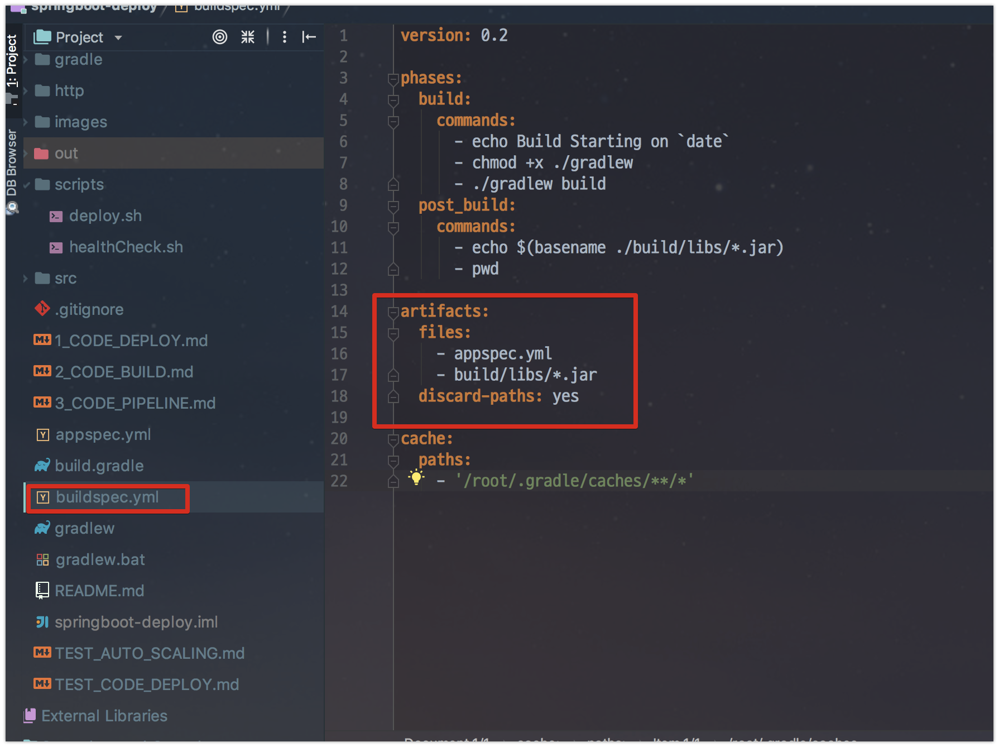

```yml
version: 0.2

phases:
  build:
    commands:
      - echo Build Starting on `date`
      - chmod +x ./gradlew
      - ./gradlew build
  post_build:
    commands:
      - echo $(basename ./build/libs/*.jar)
      - pwd

artifacts:
  files:
    - appspec.yml
    - build/libs/*.jar
  discard-paths: yes

cache:
  paths:
    - '/root/.gradle/caches/**/*'
```

여기서 변경된건 2가지입니다.

* artifacts.files
  * S3로 업로드할 대상을 지정합니다.
  * 여기서 지정된 파일들이 zip파일로 되어 S3로 업로드 됩니다.
  * jar외에 appspec.yml도 추가된 이유는, Code Deploy때문입니다.
  * **Code Build가 끝난후, Code Deploy를 실행시키기 위해** 빌드 파일 목록에 appspec.yml도 추가해야만 합니다.
* artifacts.discard-paths
  * 파일의 Path를 버리고 파일만 가져갈지를 선택합니다.
  * 예)```build/libs/*.jar```
      * 디폴트: ```/home/ec2-user/build/build/libs/springboot-deploy.jar```가 생성
      * ```yes:```: ```/home/ec2-user/build/springboot-deploy.jar```로 생성
      * yes로 할 경우엔 해당 파일만 바라보기 때문

Code Deploy 배포 스펙을 결정하는 appspec.yml로 수정합니다.

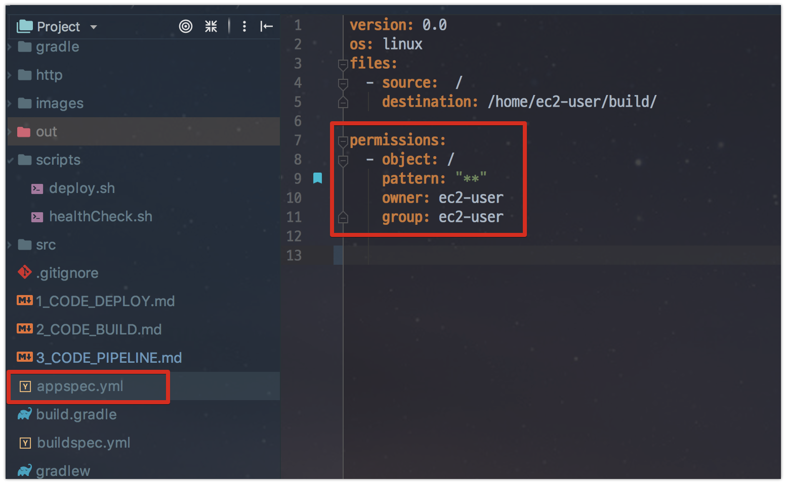

```yml
version: 0.0
os: linux
files:
  - source:  /
    destination: /home/ec2-user/build/

permissions:
  - object: /
    pattern: "**"
    owner: ec2-user
    group: ec2-user
```

여기서 추가된건 1가지입니다.  
바로 ```permissions```입니다.  
이게 없다면 code deploy로 전달되는 파일들의 **사용자/그룹이 모두 root**로 됩니다.  
ec2의 기본 사용자가 ec2-user이기 때문에 배포파일들도 모두 ec2-user에 권한이 있도록 변경합니다.  
자 그럼 이제 Code Pipeline으로 배포를 해보겠습니다.  

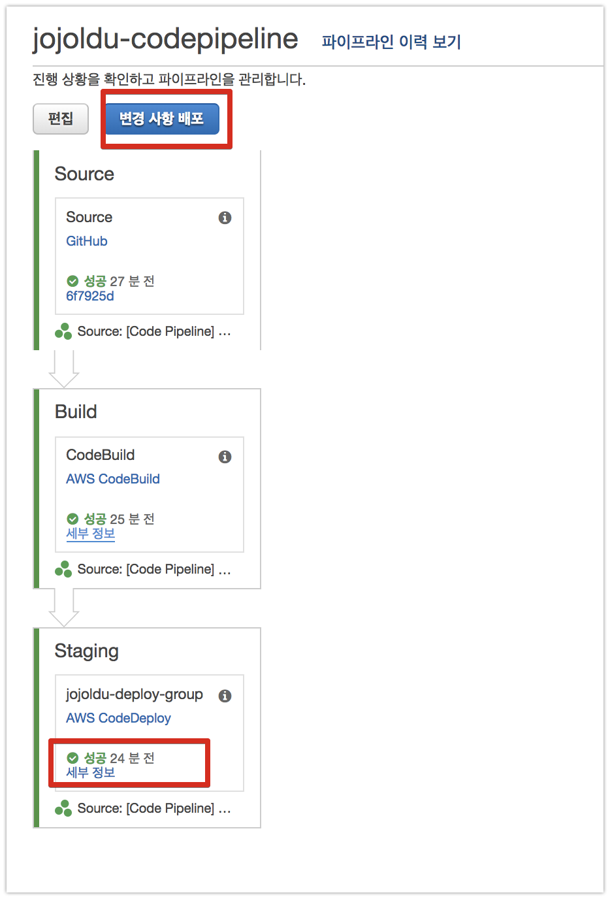

Code Deploy까지 성공적으로 끝나면 본인의 EC2로 접속해서 build 디렉토리에 배포파일들이 있는지 확인해봅니다.

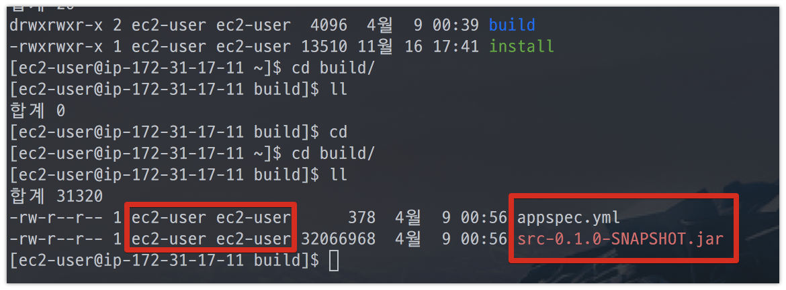

ec2-user 사용자로 appspec.yml과 jar파일이 있는것이 확인됩니다!  
여기서 한가지 이상한게 있는데요.  
jar명이 springboot-deploy (프로젝트명)이 아닌 **src로 되어있는 것**입니다.  
이유를 파악하기 위해 Code Build 로그를 보겠습니다.

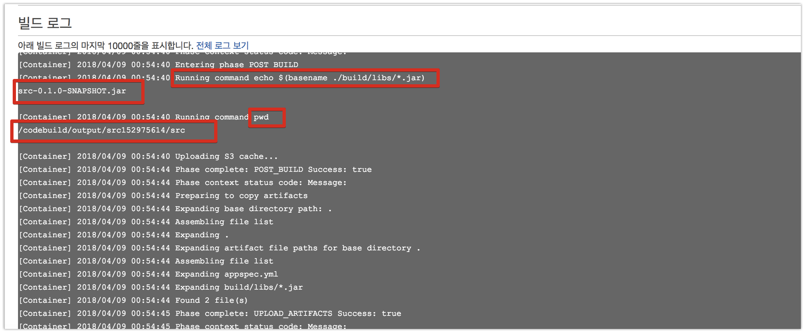

Code Build가 Github에서 바로 코드를 가져올때와 달리, Code Pipeline에서 Code Build로 소스코드를 넣어서 실행할때는 **src라는 임시 디렉토리**를 생성해서 실행합니다.  
Gradle에서 별도로 jar명을 지정안했기 때문에 프로젝트 **코드가 있는 디렉토리명이 jar명**이 되어 src라는 jar가 생성된 것입니다.  
이를 해결하기 위해 **build.gradle**에 jar명을 강제지정하겠습니다.  

```groovy
archivesBaseName = 'springboot-deploy'
```

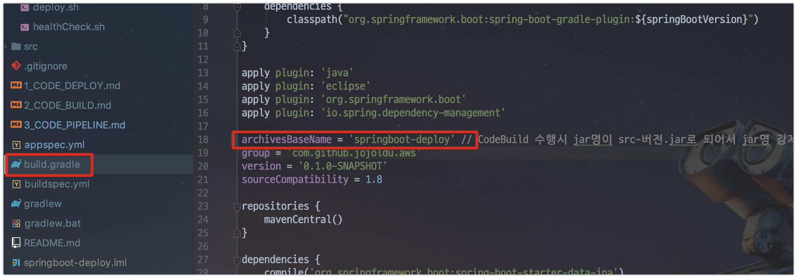