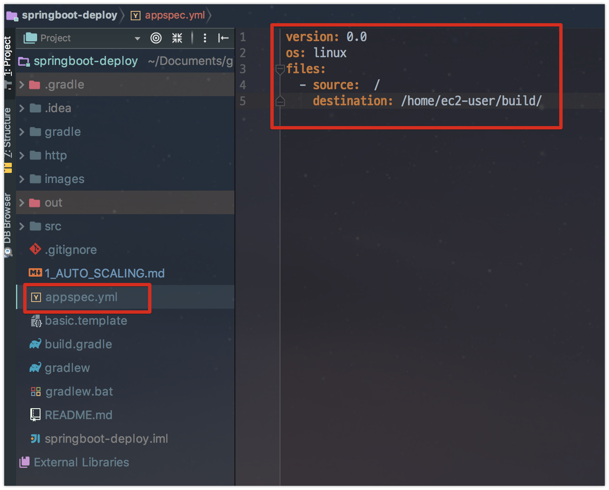
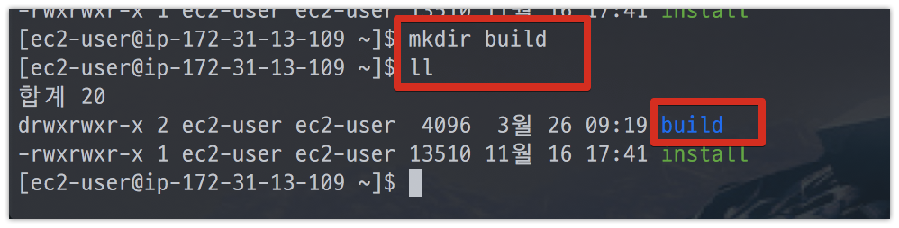
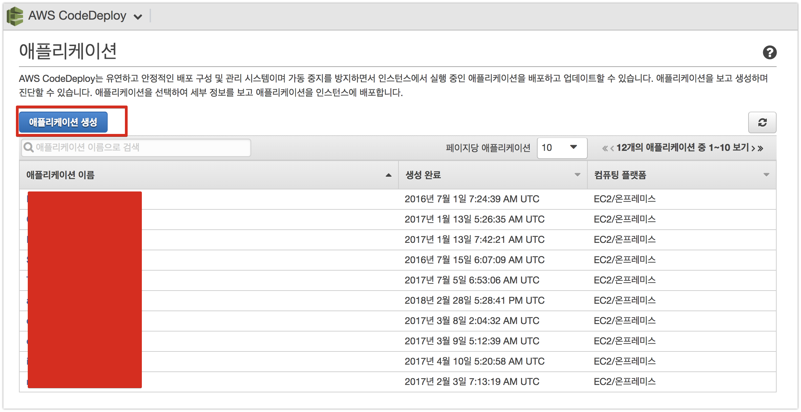
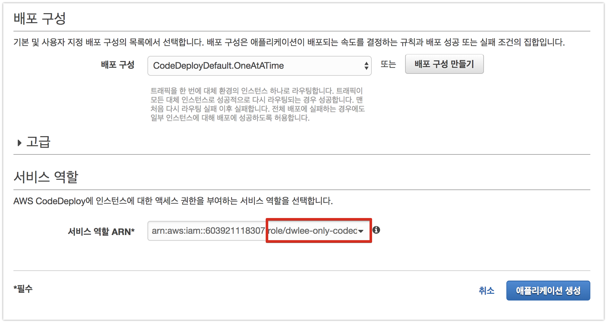
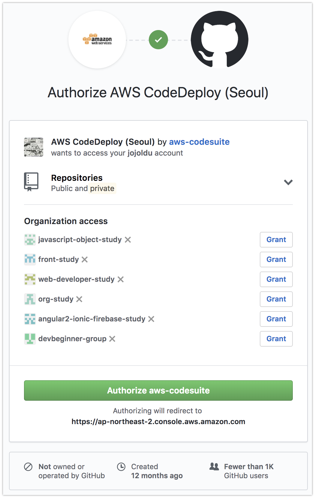
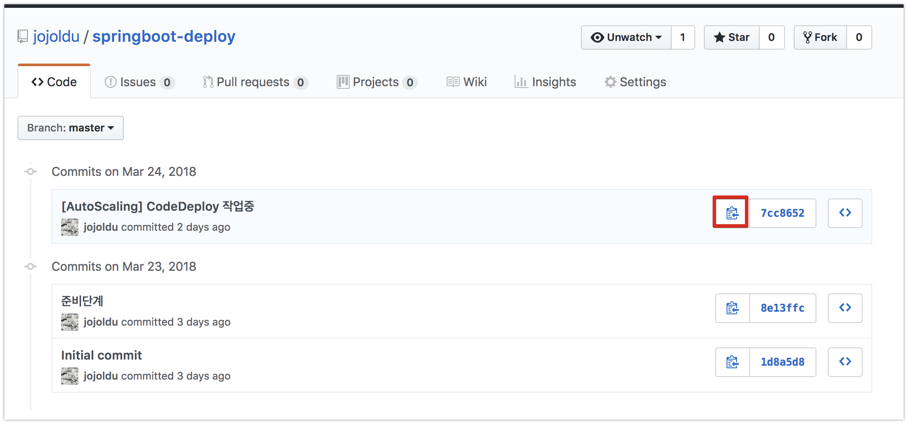
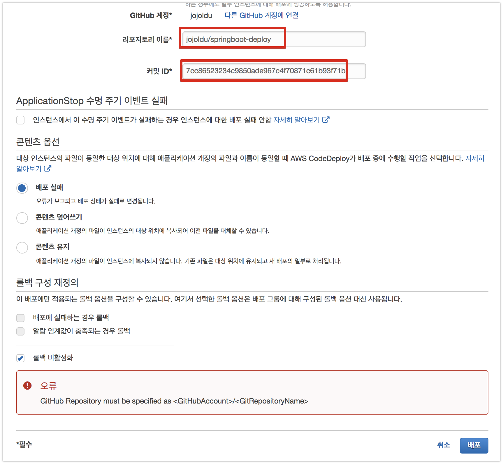
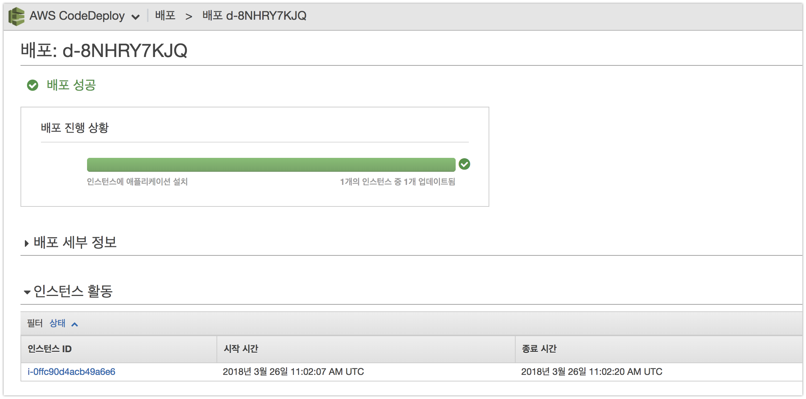

# Github & AWS Code Deploy 연동




```yml
version: 0.0
os: linux
files:
  - source:  /
    destination: /home/ec2-user/build/
```




CodeDeploy 로그 확인

```bash
cd /var/log/aws/codedeploy-agent
```
















## CloudWatch로 CodeDeploy 로그 전송

```bash
wget https://s3.amazonaws.com/aws-cloudwatch/downloads/latest/awslogs-agent-setup.py
wget https://s3.amazonaws.com/aws-codedeploy-us-east-1/cloudwatch/codedeploy_logs.conf
chmod +x ./awslogs-agent-setup.py
sudo python awslogs-agent-setup.py -n -r ap-northeast-2 -c s3://aws-codedeploy-us-east-1/cloudwatch/awslogs.conf
sudo mkdir -p /var/awslogs/etc/config
sudo cp codedeploy_logs.conf /var/awslogs/etc/config/
```

log 그룹을 변경하겠습니다.

```bash
sudo vim /var/awslogs/etc/config/codedeploy_logs.conf
```

```bash
[codedeploy-agent-logs]
datetime_format = %Y-%m-%d %H:%M:%S
file = /var/log/aws/codedeploy-agent/codedeploy-agent.log
log_stream_name = {instance_id}-codedeploy-agent-log
log_group_name = dwlee-codedeploy-agent-log

[codedeploy-updater-logs]
file = /tmp/codedeploy-agent.update.log
log_stream_name = {instance_id}-codedeploy-updater-log
log_group_name = dwlee-codedeploy-updater-log

[codedeploy-deployment-logs]
file = /opt/codedeploy-agent/deployment-root/deployment-logs/codedeploy-agent-deployments.log
log_stream_name = {instance_id}-codedeploy-deployments-log
log_group_name = dwlee-codedeploy-deployments-log
```

```bash
sudo service awslogs restart
```

